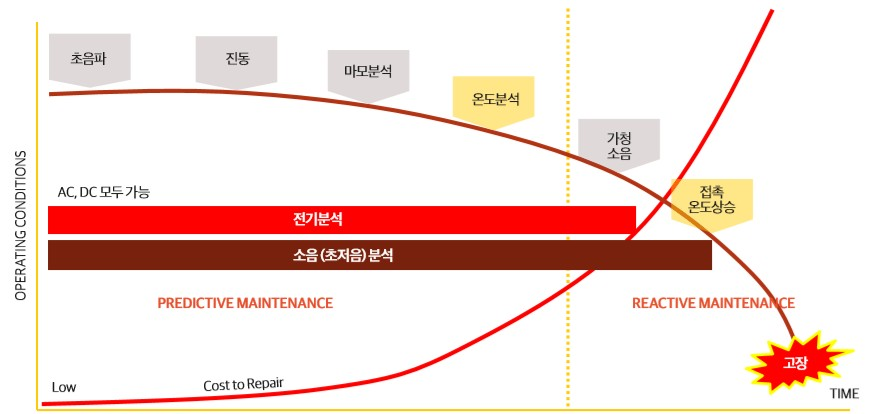
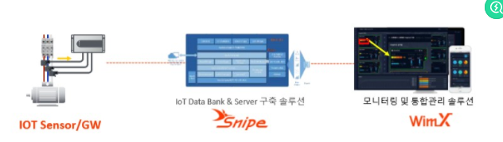
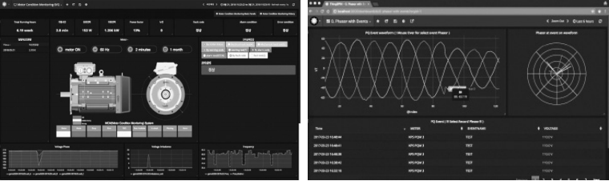

# AI 적용 사례 정리
### 작성: 이찬영 
---
## SMT 기업 사례, 설비 예지 보전과 머신 러닝

1. **설비 예지보전이란?**

- 설비 예지보전이란, 설비 또는 장비의 이상, 정지, 고장으로 발생하는 경영(운영) 손실을 최소화하기 위한 TPM 차원의 일련의 활동을 말한다. 국제적인 표준으로는 ISO 10816이 있다.

- 예지보전(PbM): 예측 정비

---

 2. **회전 구동 설비 예지보전 사례**

- 설비예지보전을 하면서 현장에서 가장 많은 관심을 가지는 장치는 회전 구동체 즉 동력을 제공하는 모터다.

- 모터에 다양한 센서를 붙이고, 시그널 데이터를 수집하여 실시간 분석을 통해 예지보전을 하고자 하는 것

---
 **모터 점검항목**
|점검항목|단점|장점|
|:------:|---|---|
|초음파|너무 많은 예산|가장 효과적|
|진동|현장 환경,장비환경에 따라 변수 많음||
|마모분석|설비를 멈추고 분해 등을 통한 접근||
|온도|||
|가청소음|효과가 떨어짐(고정 직전 또는 고장후 감지)||

---
|점검항목|단점|장점|
|:------:|---|---|
|접촉온도|효과가 떨어짐(고정 직전 또는 고장후 감지)||
|전기분석||진동에 비해 진단 및 분석이 용이|
|비가청소음(초저움)||진동에 비해 진단 및 분석이 용이|

---

**분석 시점 과 수리비용**

---

3. **정확한 분석을 위한 3가지 방법론**

- 진동, 전기, 온도, 초저음 등 다양한 시그널이 고장 등의 문제가 일어날 때 어떤 상관관계가 있는지. 넓게는 설비 작동과 어떤 관계가 있는지를 분석하는 방법

- **군집 분석**: 동일한 설비, 동일한 환경, 동일한 구동 방식을 가진 비슷한 모터나 설비 간 상호 비교 보완을 하게 하는 방법론이다.  다른 모터를 분석하는데 상호 보완적 역할을 하게 함으로써 진단이나 분석의 정확성을 높이고 있다.

---

- **이벤트 정의프로그램**을 통해 등록된 현장에서 모터 이상의 원인 이벤트를 직접 등록할 수 있고, 머신 러닝 알고리즘은 등록된 이벤트를 참조로 분석력과 정확성을 높이게 된다.

---

## 포스코 기업 사례

|주요분야|Breakthrough|
|:---:|---|
|설비예방정비|다양한 설비 데이터를 수집한 후 인공지능 분석을 적용하여 예방정비|
|공정간 연계제어|예측하기 힘든 공정 간 품질결함을 인공지능 분석을 통해 예측|
|전문가 공정제어|전문가 공정제어에 강화학습 기반의 인공지능을 적용, 생산성 성과를 보여줄 것으로 기대 |
|로봇 자동화|인공지능과 로봇의 융합을 통해 로봇 스스로 학습이가능해짐으로써 다양한 작업에 대핚 범용성 증가|

---

### 1) 설비 예방정비

1. **설비 예방정비의 현황과 이슈**

    - IoT 기술이 발달하면서 모터 진동, 소요 전압, 전류, 유량, 압력 등 다양한 데이터의 모니터링과 통계분석이 가능해져 GE가 자사의 엔진, 발전기 터빈 등의 예방정비에서 성과를 거두기 시작

---

2. **RNN4 기반 읶공지능을 활용한 Breakthrough**
    - Time Series Data 분석에 효과적읶 RNN(Recurrent Neural Network, 순환 신 경망) 기반의 인공지능 분석 기법이 적용되면서 통계적 인과관계가 분명하지 않은 설비 예방정비에서도 신뢰성 있는 분석 결과를 보여줌

    - GE를 비롯핚 선진기업이 설비 예방정비에 인공지능 분석기법을 도입했으며, 올해 글로벌 스마트팩토리 컨퍼런스에서도 일부 기업들이 RNN 기반의 설비 예방정비 성공 사례를 발표
---

### 2)공정간 연계제어

1. **공정간 연계제어의 현황 및 이슈**
    - 공정 간 연계제어를 위해서는 주요 설비의 공정 데이터를 실시간으로 통합하고 분석하는 Connected Factory 구축이 요구, 설비 업체별로 서로 다른 데이터 포맷을 통합하고 실시간 DB를 운영하기 위해서는 대규모 투자 필요

    - 데이터 통합에 성공했다 하더라도 공정 간 상호작용에 대한 이해 부족, 상호작용을 분석하기 위한 Big Data 인프라 및 분석 역량 부족으로 적용 사례는 일부 반도체 기업에 국한
---
2. **Big Data 인프라 + 인공지능 분석을 통한 Breakthrough**
    
    - IoT 기술 도입과 Big Data 읶프라 발전, 공정 데이터 통합을 위핚 OPC-UA 표준이 논의되기 시작하면서 공정 간 데이터 통합이 용이해짐

    - 인공지능 분석을 통해 공정 갂 서로 다른 도메인 지식과 복잡한 통계분석에 의존하지 않고 품질 불량을 더 정확하게 예측하는 것이 가능

---

### 3) 전문가 공정제어

1. **전문가 공정제어의 현황 및 이슈**
    - 복잡한 제어 특성을 반영한 정확핚 운영 Model 개발 곤란, 약간의 설비 변경, 유지보수 등의 변화에도 Model 재설계가 불가피

2. **학습 가능한 인공지능(딥러닝)을 활용한 Breakthrough**
    - 안공지능의 장점은 강화학습을 통해 운영 Model을 정확하게 유추할 수 있고, 공정환경의 변화에도 스스로 운영 Model을 수정하면서 최적 제어를 할 수 있기 때문에 추가 유지보수가 필요 없다는 것

---

### 4) 로봇 자동화

1. **로봇 자동화의 현황 및 이슈**
    - 로봇의 제작 비용이 지속적으로 낮아지고 인건비는 상승
    - 한정된 작업맊 수행 가능한 낮은 범용성과 높은 가격으로 핵심 공정에만 제한적

2. **인공지능과 로봇의 융합을 통한 Breakthrough**
    - 작업 방법을 빠르게 습득할 수 있다, 범용성  증가
    - 로봇의 범용성에 따라 로봇으로 대체 가능한 작업이 증가할 것

---

## 한컴MDS, 제조업 AI 솔루션

### 1) 제조업에서 AI 활용 분야

1. 제품 수요 및 매출 예측 AI 
2. 제조업 R&D 과정 단축, 재료 분석 및 선정, 테스트 간소화
3. 불량품,설비고장 사전 예측,수율 향상 
4.  제품 사후 관리 자동화
5. 스마트 제품

---

### 2) 품질 결함 감지

1. 한기계학습 모델을 가시화하여 문제 요인을 발견

2. 어떤 요인이 불량품의 발생에 영향을주고 있는지, 어떤 요인을 변경하여 품질이 어떻게 바뀌는지 기계학습모델이 발견한 복잡한 패턴을 설명

---

### 3) 예방 정비

1.  기계학습은 생산 설비에서 나오는 전류, 진동, 소리 등 다양한 데이터를 학습하여 그 설비 자체의 고장 및 잔존 수명을 예측
2. 기계학습 모델의 가시화로  고장 요 인을 특정할 수 있어 이를 바탕으로 유지보수를 사전에 실시하는 것으로 설비의 가동률 향상

---

### 4) 특성예측

1.  새로운 제품이나 재료를 검증하는 R&D도 제조업의 핵심

2.  예를 들어, 여러 가지 재료의 혼합 방법을 시뮬레이션을 통해 최적화

3. 테스트의 횟수를 줄임으로써 보다 효율적인 R&D가 가능

---

### 5) 제조업에서 자주 활용되는 DataRobot 기능

1. 기계학습 자동화, 기계학습 모델 가시화

2. 주요 활용 기능 
    - 특징량의 임팩트
    - 모델 X-Ray
    - 리즌 코드

---

### 6) 특징량의 임팩트

1. 특징 량의 영향 정도를 100%로 했을 때 다른 특징량이 얼마나 영향을 미쳤는지 표시

2. 재료 선정과 가공조건의 조정을 효율화할 수있다.

3. 예를 들어, 영향력이 적은 재료와 가공조건을 제 거하여 재료와 테스트 비용과 시간을 절감

---

### 7) 리즌(Reason) 코드

1. 예측을 액션에 바로 연결하는데 매우 유용한 기능

2. 예를 들어, 불량이나 고장이 생기는 여러 가지 이유를 이해함으로써 불량이나 고장이 발생하지 않도록 세밀한 파라미터의 튜닝(액션)을 할 수 있다.

---

### 8) 모델 X-Ray

1. 특징량의 값을 바꿀 때 예측에 어떻게 영향을 미치는지 명확하게 확인

2. 예를 들어, 파라미터 변경이 불량품이나 설비 고장 예측에 어떤 영향을 미치는지를 이해할 수 있다

---

### 9) 이상치 탐지

1. 이상치 탐지 는 이상치와 특이성을 데이터에서 검출하는 방법 

2. 뭔가 평소와 다른 일이 일어 나고 있다는 것을 경고해 준다.

3. 과거의 결함이나 고장의 데이터가 충분히 존재하지 않는경우, 지도학습을 할 수 없다.