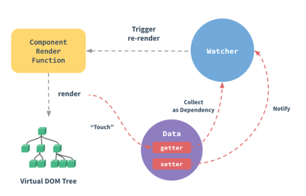

# Composition API
### 작성: 이찬영
---
### Composition API란?
- 2020년 4월 19일 vue.js 3.0 배타 번전에서 추가된 새로운 방식의 API
- 기존의 방식인 Options API의 단점을 보완하기 위해 주로 사용된다.
- 기존의 mixin(재사용 기능), 오버라이딩 문제 해결
- 컴포넌트 관리가 쉬워진다.
---
### Options API vs Composition API
```
<template>
    <div>
        <h1>Count: {{ count }}</h1>
        <h1>Double: {{ double }}</h1>
        <button @click="increase">increase</button>
        <button @click="decrease">decrease</button>
    </div>
</template>
```
----
### Options API
```
<script>
export default {
    data () {
        return { count: 0,}
    },
    methods: {
        increase () { ++this.count; },
        decrease () { --this.count; }
    },
    computed: {
        double () {return this.count * 2; }
    }
}
</script>

```
---
### Options API
- 기능을 가진 로직들이 data, methods, computed로 각각 분리된다.
-  로직이 많아지게 되면 여러 라이프사이클 훅에 로직들이 흩어지게 된다.
- 따라서 가독성 떨어진다.
---
### Composition API
```
<script>
import { reactive, computed } from '@vue/composition-api';
const useCount = () => {
    const count = ref(0);
    const double = computed(() => count.value * 2);
    const increase = () => ++state.count;
    const decrease = () => --state.count;
    return { count, double, increase, decrease }
}
export default {
    setup () {
        const { count, double, increase, decrease } =useCount();
        return { count,double,increase,decrease}
    }
}
</script>
```
---
### Composition API
- 분산된 로직 문제를 해결로 가독성 증가
- setup을 통해서 초기화를 진행
- 라이프사이클 변화
    - beforeCreate,created -> use setup()
    - beforeMount -> onBeforeMount
    - mounted -> onMounted
    - beforeUpdate ->onBeforeUpdate
    - updated -> updated
    - beforeDestroy -> onBeforeDestroy
    - destroyed -> onDestroyed
    - errorCaptured -> onErrorCaptured
---
 - 신규 훅 
    - onRenderTracked
    - onRenderTriggered
- 객체 접근 방식의 변경 
    - this.$ 으로 접근하던 (ex. this.$router,this.$refs) 등을 this 없이 setup() 에서 받아서 사용
---
### 반응형이란?


---
- 컴포넌트의 data 에 변경을 해줘도 props 로 자식에게 전달해준 값이 갱신되지 않는문제를 해결해준다.
- vue가 컴포넌트 인스턴스의 data 속성 값을 추적하여 화면에 랜더링하는 방법
 - 인스턴스마다 할당된 watcher 를 통해 변경 사항을 추적 및 관리한다.
 - 인스턴스 초기화 단계에서 data 의 모든 속성에 getter / setter 를 생성
 - DOM 업데이트의 비동기 수행
    - 모든 데이터 변경을 버퍼에 기록(큐)
    - 이벤트 루프 tick 에서 변경 작업을 수행
---
### reactive
```
const getObject = reactive({ index: 1, index2: 2});
console.log(getObject.index) //1 
console.log(getObject.index2)//2
``` 
 - reactive는 반응형 상태를 선언해 주는 역할
 - 객체만 받을 수 있도록 되어있고, 인자로 받은 객체와 동일한 프록시 객체를 반환
 - 기존방식의 Vue.observable()와 동일한 객체가 생성
 ---
 ### ref
 ```
 const count = ref(0)
console.log(count.value) // 0

count.value++
console.log(count.value) // 1
 ```
- ref는 내부 값을 가져와 반응, 변경 가능한 객체를 반환합니다.
- ref 객체에는. value로 내부 값에 접근할 수 있습니다.
- reactive의경우는 여러 속성을 가지고 모두 추적하지만 refs는 단하나의 속성(vlaue)만을 추적한다. 
---
### 템플릿에서 액세스
```
<template>
    <div>{{ count }}</div>
</template>

<script>
export default {
    setup() {
        return {count: ref(0)}
    }
}
</script>
```
---
### readonly
```
const original = reactive({ count: 0 })
const copy = readonly(original)
original.count++
copy.count++ // warning
```
- 반응형 객체의 변이 방지
---
### computed
```
const count = ref(1);
const plusOne = computed(() => count.value + 1);

console.log(plusOne.value); // 2
plusOne.value++; // error
```
- getter 함수를 가져오고 getter에서 반환된 값에 대한 변경 불가능한 반응성 참조 객체를 반환합니다.(계산된 값)
- gett 및 set 함수가 있는 객체를 사용 가능
---
### watchEffect
```
const count = ref(0)
watchEffect(() => console.log(count.value))// -> logs 0
```
 - 반응형 상태에 따라 사이드 이펙트를 적용
 - 차이점 
    - 감시종료 ,이펙트 무효화
    - 디버깅등 추가기능 지원
---
### watch
```
const state = reactive({ count: 0 })
watch(() => state.count,(count, prevCount) => {
    /* ... */
  }
)
```
- 특정 데이터 소스를 관찰하며 별도의 콜백 함수에서 사이드 이펙트를 적용
- 차이점
    - 지연 실행,구체적인 트리거구현 가능 
    - 변경전 값과, 변경후 값에 모두 접근 가능


