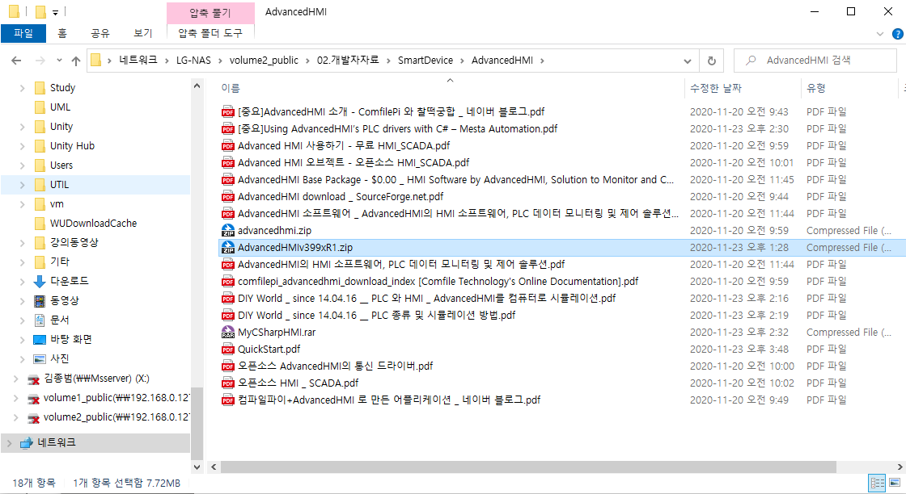

# AdvancedHMI

### 작성: 이찬영

---

## 소스코드 다운로드

- LG-NAS\volume2_public\02.개발자자료\SmartDevice\AdvancedHMI 로 이동한다.
- [AdvancedHMIv399xR1.ZIP](http://advancedhmiv399xr1.ZIP) 을 다운받아 압축을 푼다.

---

## 프로젝트 가져오기

- 솔루션 (마우스 오른쪽 클릭)→ 추가→기존프로젝트

---

## 프로젝트 가져오기

- AdvancedHMIDrivers.vbproj, AdvancedHMIControls.vbproj 를 가져온다.

---

## 프로젝트 가져오기

- 도구상자에 도구가 추가된다.
- 드라이버 도구를 통해서 PLC 와 통신한다.
- 컨트롤 도구로 데이터 확인 및 제어 한다.

---
- 도구를 활용하여 아래와 같이 만든다.

- PLC 에 맞게 드라이버 도구를 사용 (저는 테스트를위해 ModbusTCP를 사용한다.)

---

## 컴포넌트 속성 설정

- 속성에서 IP 주소를 설정 (127.0.0.1은 로컬주소)

---

## 컴포넌트 속성 설정

- PLCAddressClick 에 PLC 의 주소를 입력한다.

---

## 컴포넌트 속성 설정

- PLCAddressValue에서 입력받을 PLC 주소를 정한다