# STS 환경 설정
## 작성: 이찬영
---
# STS,JAVA,JDK 설치

- STS URL: [https://spring.io/tools](https://spring.io/tools)
- java URl:[https://java.com/ko/download/](https://java.com/ko/download/)
- JDK URL:[https://www.oracle.com/java/technologies/javase/javase-jdk8-downloads.html](https://www.oracle.com/java/technologies/javase/javase-jdk8-downloads.html)

---

# STS GIT 연동

- window→show View → Other

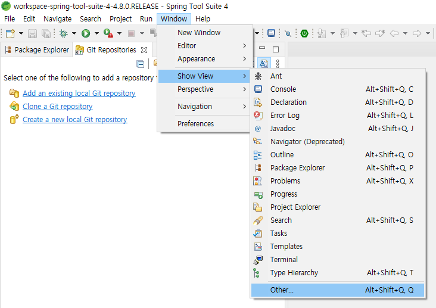

---

# STS GIT 연동

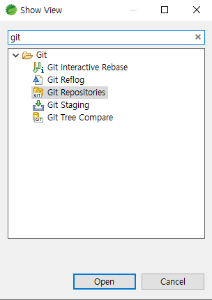
- git 을 검색
- git Repositories 를 선택

---

# STS GIT 연동

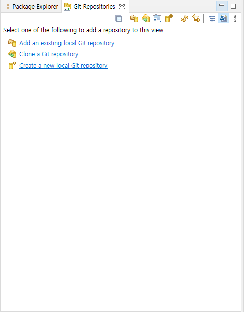

- Clone a Git repository를 선택

---

# STS GIT 연동

- URL 과 User,Password 를 작성 해야 한다.

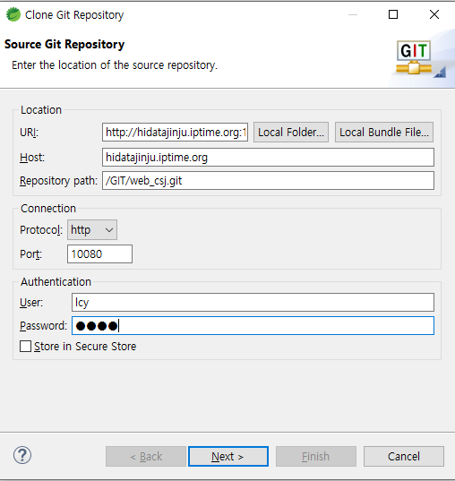

---

# STS GIT 연동

[http://hidatajinju.iptime.org:10080/GIT](http://hidatajinju.iptime.org:10080/GIT) 으로 이동후 로그인 (git 계정으로 로그인 )

---

# STS GIT 연동

- 동의 초석잠 web_csj 를 선택

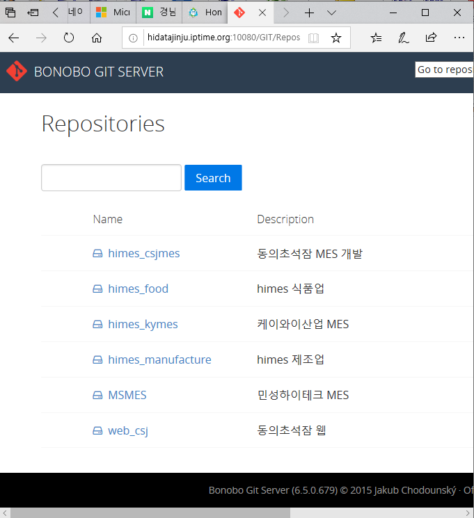

---

# STS GIT 연동

- GIT URL을 복사하여 STS에 작성 한다.

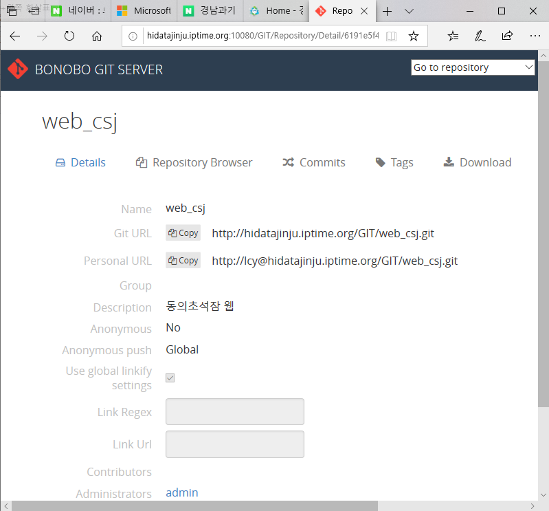

---

# STS GIT 연동

- web_csj 레파지토리가 생성 된다.
- 레파지토리를 좌클릭 하여 Import Projects를 선택한다.

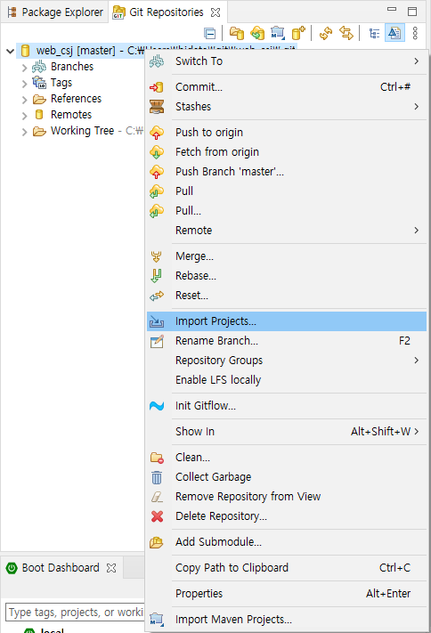

---

# STS GIT 연동

- 패키지가 생성 되었으면 좌크릭 → 메이븐 → Update Project를 진행한다.

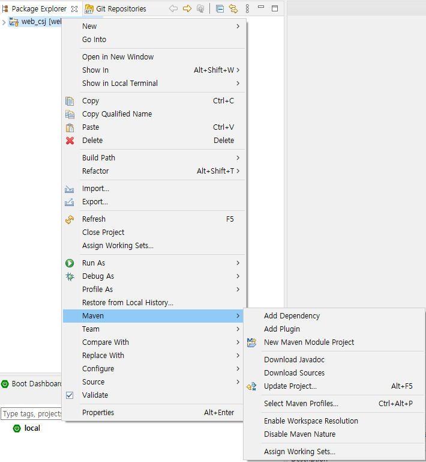

---

# STS GIT 연동

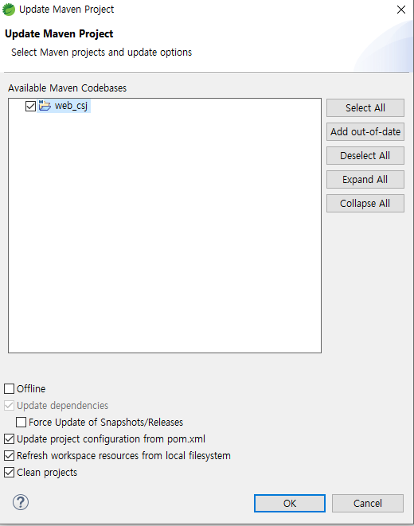

---

# 오류 해결 방법

- lombok 오류
    - get,set함수를 찾지못하는 오류
    - **Solve**: STS 에 lombok 을 적용 시켜준다
- xhtml 연산자 오류
    - ? 등의 연산자를 오류로 인식하는 오류
    - **Solve**: 연산오류를 무시하게 설정한다.

---

# lombok 오류

- 프로젝트 의 Libraries→ Maven Dependencies→ lombok을 찾아서 설치된 장소를 알아낸다.

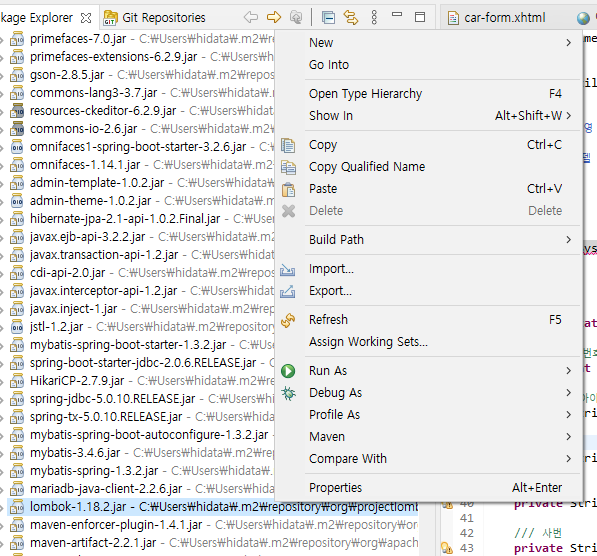

---

# lombok 오류

- 디렉토리로 이동해서 커맨트 창을 열고 JAVA -jar lombok경로및파일명.jar 명령어로 실행한다.

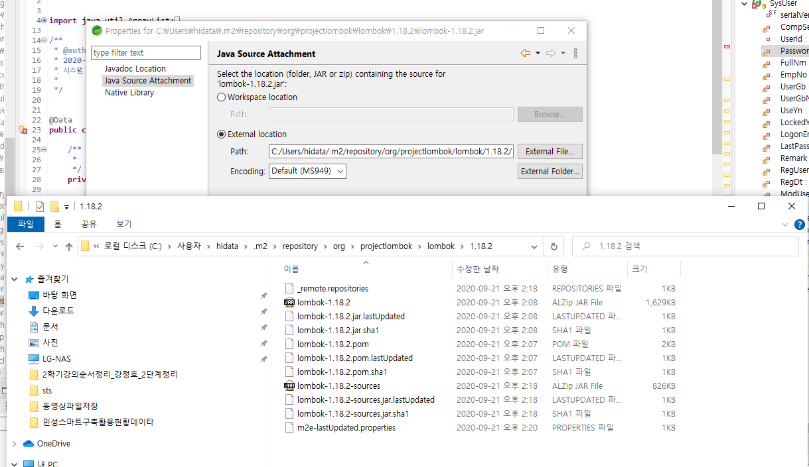

---

# lombok 오류

- Specify locationd→ STS를 선택합니다.
- Install ,Updata를 하고 STS 재실행 하면 오류가 사라진다.

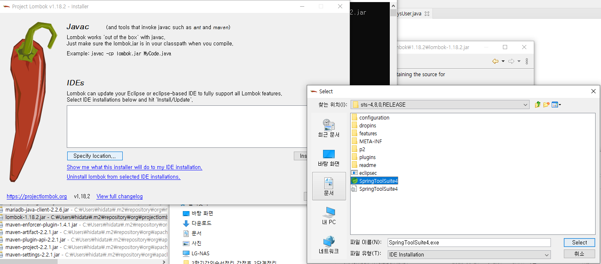

---

# xhtml 연산자 오류

---

# 실행시발생하는 오류

- javax.annotation.*  오류

    

---

# 실행시 발생하는 오류

- javax.xml.bind.* 모듈 오류

