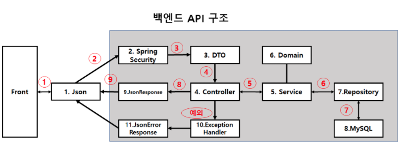
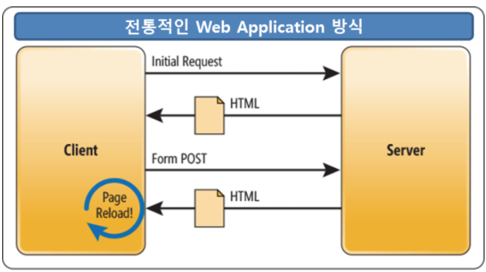
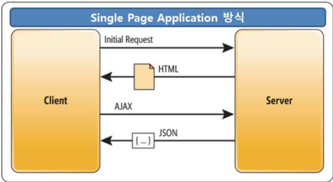
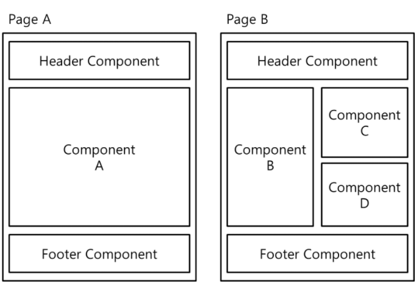

# SpringVue 데모개발 정리
### 작성: 이찬영
---
## 구현 방식
 - 서버 : Spring boot
 - 프론트엔드: Vue,PrimeVue
## 개발환경 
 - 서버: java, sts4, jdk1.8,마리아디비
 - 프론트엔드: vscode, node.js(v16.1.0)
    - node.js 설치: https://nodejs.org/en/
---


---
## 서버: Spring boot API 개발 코드
```
@Controller
public class RootController {
    @RequestMapping("/")
    public String index() {
        log.info("Root");
       return "index.html";
    }
}
```
- 루트로 접근시 해당컨트롤러에서 vue 로 생성된 index.html을 받는다. 
---
## ItemsController
```
@RestController
@RequestMapping(value = "/items")
public class ItemsController  {
    @Autowired
	private PdItemService itemService;
	Gson gson;

```
- URL '/items'로 HTTP 요청이 들어왔을때 데이터를 전송해준다.
- @RestController : RestAPI 구현용 컨트롤러 어노테이션
오직 한 번만 수행
- gson: json 생성 라이브러리
---
## init()
```
@PostConstruct    
	public void init() {
		gson  = new GsonBuilder().registerTypeAdapter(Date.class, new GsonDateConverter()).create();
	}
```
- init(): 전역 변수를 초기화한다.
-  @PostConstruct: 호출 되었을 때 실행,bean lifecycle에서 
---
## CRUD 함수
- REST API 설계 예시

|CRUD |HTTP verbs|Route|어노테이션|
|:---:|:---:|:---:|:---:|
|목록 표시|GET|/resource|@GetMapping("")|
|1개 표시|GET|/resource/:id|@GetMapping("/{id}")|
|생성|POST|/resource|@PostMapping("")|
|수정|PUT/PATCH|/resource/:id|@PatchMapping("/{id}")|
|삭제|DELETE|/resource/:id|@DeleteMapping("/{id}")|
---
## CRUD 함수 기본구조
- URL 파라미터 or RequestBody 데이터가 _item으로 자동으로 맵핑되어 들어온다.
- @PathVariable 로 아이디를 받아온다.
- 목록을 조회하고 데이터를 jason 형식으로 전송
- 실패시 오류 코드와 HttpStatus.NOT_FOUND 를 전달
- ResponseEntity<String> 데이터를 리턴
- log.info(" ")는 로그를 출력하여 데이터 확인 
---
## getList (목록 조회)
```
@GetMapping("")
public ResponseEntity<String> getList(PdItem _item)
{
	JsonObject result = new JsonObject();
	try {
		List<PdItem> list = itemService.selectList(_item);
	    result.add("data", gson.toJsonTree(list));
	} catch (Exception e) {
			// TODO Auto-generated catch block
		e.printStackTrace();
		result.addProperty("error", e.getMessage());
		return new ResponseEntity<String>(result.toString() ,HttpStatus.NOT_FOUND);
	}
    return new ResponseEntity<String>(result.toString(), HttpStatus.OK);
}
```
---
## getOne (데이터 조회)
```
@GetMapping("/{id}")
public ResponseEntity<String> getOne(@PathVariable("id") int  id)
{
	JsonObject result = new JsonObject();
	PdItem item = new PdItem();
	try {
		item.CompSeq = 1;
		item.ItemSeq = id;
		PdItem data = itemService.selectOne(item);
		result.add("data", gson.toJsonTree(data));
	} catch (Exception e) {
		// 오류처리
	}
    return new ResponseEntity<String>(result.toString(), HttpStatus.OK);
}
```
---
## inserOne(데이터 입력)
```
@PostMapping("")
public ResponseEntity<String> inserOne(@RequestBody PdItem _item)
{
	JsonObject result = new JsonObject();
	try {
		itemService.insertOneGetKey(_item);
	} catch (Exception e) {
			// 오류 처리
	}
	result.addProperty("data",true);
	return new ResponseEntity<String>(result.toString(), HttpStatus.OK);    
}
```
---
## deleteOne(데이터 삭제)
```
@DeleteMapping("/{id}")
public ResponseEntity<String>  deleteOne(@PathVariable("id") int  id)
{
	JsonObject result = new JsonObject();	
	try {
		PdItem item = new PdItem();
		item.CompSeq =1;
		item.ItemSeq = id;
		itemService.deleteOne(item);
	} catch (Exception e) {
		// 오류처리
	}
	result.addProperty("data",true);
    return new ResponseEntity<String>(result.toString(), HttpStatus.OK);
}
```
---
## updateOne(데이터 갱신)
```
@PatchMapping("/{id}")
public ResponseEntity<String> updateOne(@PathVariable("id") int  id,@RequestBody PdItem _item)
{
	JsonObject result = new JsonObject();	
	try {
	    itemService.updateOne(_item);	
		result.addProperty("data",true);
	} catch (Exception e) {
		// 오류 처리
	}
    return new ResponseEntity<String>(result.toString(), HttpStatus.OK);
}
```
---
## PUT vs PATCH
- PUT : 자원의 전체 교체, 자원교체 시 모든 필드 필요
    - (만약 전체가 아닌 일부만 전달할 경우, 
    전달한 필드외 모두 null or 초기값 )
- PATCH : 자원의 부분 교체, 자원교체시 일부 필드 필요
---
## 멀티키 REST API 
 - hostname/pages/{id1}/{id2}/....
 - hostname/pages/{id1}_{id2}/....
 - hostname/pages/id1/{id1}/id2/{id2}/....

## 조인 키가 존재
- hostname/pages/id/pages2/id/....

---
## SPA(싱글 페이지 에플리케이션)


---
## SPA(싱글 페이지 에플리케이션)


---

## SPA 의 특징
 - SPA란?
	- 서버로부터 새로운 페이지를 불려드리지 않고 문서를 동적으로 다시작성하는 기술 
	- 새로고침이 없고 DOM 부분만 갱신할수있다.
- 라우팅
	- 화면전환을 위한 네이게이션으로 URL을 해석하여 해당화면을 구성한다. 
	- 라우팅을 백단이 아닌 브라우저에서 구현하는것이 핵심기능이다. 
	- 요청에따라 돔을 동적으로 생성하여 문서내용을 변경한다.(랜더링 된다.)
---
## 컴포넌트
- 특정부분만 바인딩하는 개념 


---
## SPA 의 장점

 - 네이티브 앱과 개발/결과 유사
 - 리소스 다운 1회만 진행
 - 트레픽 감소
 - 새로고침 없음
 ## 단점 
 - 최초 구동느림
 - 검색엔진 최적화 이슈 존재
---
# 프론트 엔드 개발
 - Page : .vue 로 구성된 템플렛 컴포넌트, 하나의 파일이 하나의 화면 or 컴포넌트를 구성한다.
 - Service : axios를 통해 http 요청을통해 서버와 rest api로 데이토를 주고 받는다. 
 - Utils : 유용한 전역 함수 or 도구 
 - router.js : url 과 컴포넌트(vue 파일)을 등록하여 화면을 등록하는 파일
 - main.js: 메인 파일로  프로젝트 에서 사용할 컴포넌트를 지정한다.
 ---
 ## main.js
  ```
 // css 파일 임포트
import './assets/layout/flags/flags.css';
// 컴포넌트 임포트
import { createApp, reactive } from 'vue';
// vue 앱 생성
const app = createApp(App);
// 앱설정
app.use(router);
app.directive('badge', BadgeDirective);
// 앱설정-컴포넌트 설정
app.component('AutoComplete', AutoComplete);
// 앱 마운트  
app.mount('#app');
  ```
---
## router.js
```

const routes = [
    {
        path: '/simplePage',  // URL 경로 
        name: 'simplePage',  // 페이지 이름 

        // 파일 경로
        component: () => import('./pages/simplePage.vue'), 
    },
    // ...추가경로정보...
]
```
---
## ItemService.js
```
// HTTP 비동기 통신 라이브러리 임포트
import axios from 'axios'  

export default class ItemService {
	// 데이터 목록 조회
	getList(_params) {
		return axios.get('/items', { params: _params }).then(res => res.data.data);
	}
    // 데이터 조회
	getOne(_id) {
		return axios.get('/items/'+_id.toString()).then(res => res.data.data);
	}
```


---
## 
```
    // 데이터 입력
	insertOne(_data) {
		return axios.post('/items',_data).then(res => res.data.data);
	}
    // 데이터 업데이트 
	updateOne(_id,_data) {
		return axios.patch('/items/'+_id.toString(),_data).then(res => res.data.data);
	}
    // 데이터 삭제
	deleteOne(_id)
	{
		return axios.delete('/items/'+_id.toString()).then(res => res.data.data);
	}
```
---
## ItemPage.vue
```
<template>
 // html 입력, 화면or 컴포넌트의 틀을 구현 
 // EX) <Table> , <Button> 
</template>

<script>
// 스크립트 정보를 입력, 기능을 구현한다.
</script>

<style lang="scss" scoped>
// css 를정의 한다. 화면을 꾸미는 용도
</style>
```
---
## primeVue 컴포넌트 
```
<Button label="New" icon="pi pi-plus"
 class="p-button-success p-mr-2" @click="openNew" />
```
 - v-on: 이벤트 핸들링 콜백함수를 지정할수이있다. 줄려서 '@'로 표현한다. 
    - @click(클릭 이벤트)
---
## primeVue 컴포넌트
 ```
  <DataTable ref="dt" :value="data">
    <Column  :field="field" :header="header" :key="field"/>
  </DataTable>
 ```
  - v-bind: 는 데이터를 바인딩 한다는 표시로 컴포넌트에 데이터를 입력하는것이다 줄여서 ':' 로 표현된다.
---
## primeVue 컴포넌트
```
<TriStateCheckbox id="searchUseYn" v-model="searchUseYn" />
<InputText v-model="searchId" type="text" />
```
 - v-model: 데이터를 입력받을 js 변수를지정 해야한다.
 ---
 ## Js 구현 
 ```
<script>
import { ref, onMounted } from 'vue';
import UserService from '../service/UserService';
import CmmCodeService from '../service/CmmCodeService';
import JsUtils from '../utilities/JsUtils';
export default {
	setup() {
        onMounted(() => {
            // DOM 마운트시 실행될 함수, 데이터 초기화한다. 
        }
        //  js 스크립트 구현
    }
 ```
  - 필요한 컴포넌트 모두 임포트한다.
 ---
 ## js 구현 규칙
 ```
 const compSeq = 1; // 상수로 사용할경우 
 const users = ref(); // 반은성으로 상용할경우
 const searchUseYn = ref(null); // 값 초기화
 const columns = ref([   // 배열 선언 
            {field: 'UserId', header: '아이디'},
            {field: 'FullNm', header: '성명'},
        ]); 
const clickSearchBtn =()=>{ } // 함수 선언

// 외부에 바인딩 하기위해서는 리턴에 포함되어야한다.
return { users ,searchUseYn, columns,clickSearchBtn } 

 ``` 
 ---
 ## 반은형 이란?
  - vue에는 비간섭적인 반응성 시스템이 존재한다.

  - vue에서 모델은 Model은 프록시로 감싸진 자바스크립트 객체입니다. 
    -  모델을 변경하면 화면이 바뀐다.
- 따라서 반응성 시스템은 어플리케이션의 상태관리를 단순하고 직관적으로 만듭니다.
 --- 
 ## 기존방식
  - 값 중 하나라도 변경되는지 여부를 감지합니다.
  - 값을 변경하는 함수가 호출되는지 추적합니다.
  - 함수를 호출하여 변경을 발생시켜 최종 값을 갱신합니다

 ---
 ## vue 방식
  - 자바스트립크 객체를 data옵션으로 어플리케이션이나 컴포넌트 인스턴스에 전달하면, Vue는 주어진 객체의 모든 프로퍼티를 프락시(Proxy)로 변환
  -  프락시(Proxy)는 다른 객체나 함수를 감싸는 객체이며, 원본으로의 호출을 중간에 가로채서 처리할 수 있게 합니다.
 - 자세한 내용 https://v3.vuejs-korea.org/guide/reactivity


 


