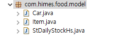
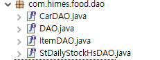
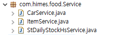
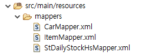
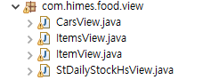
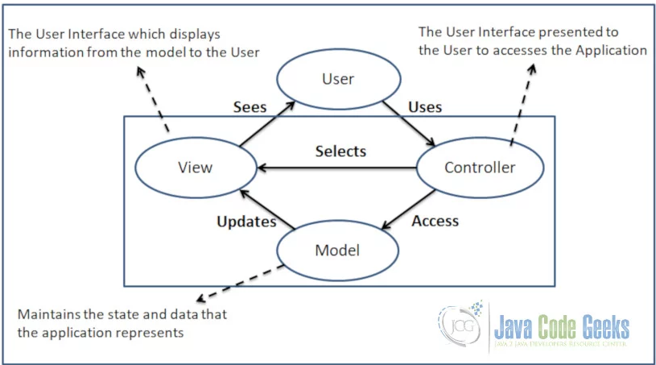
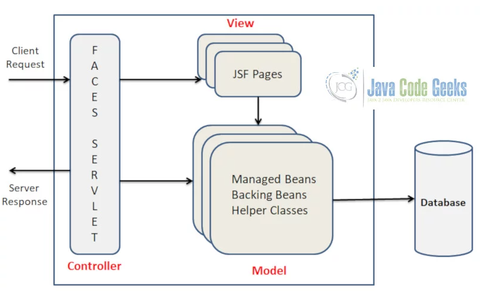
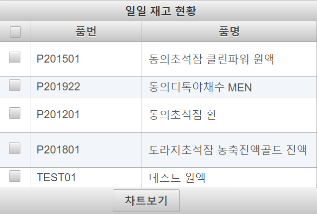
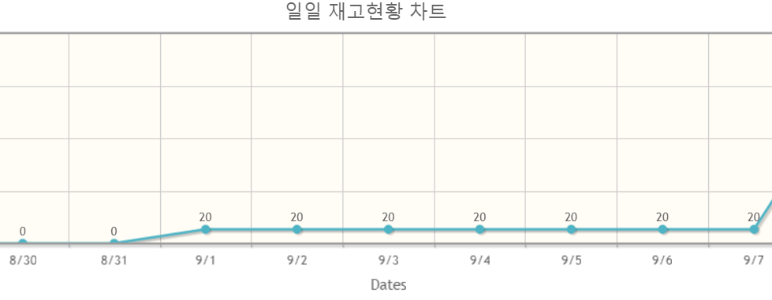

# 식품업 MES WEB 시스템 데모
- 작성자: 이찬영
---
# 개발 환경
- Spring boot
- Spring boot Security
- JSF
- JoinFace
- JoinFace
---
# 파일 시스템 구조
 - com.himes.food
 - DAO
 - Model
 - Service
 - View
 - resource

---
# com.himes.food
  - 보안 설정, 자바 메인등 프로젝트 설정 class를 가지는 패키지


---
# SecurityConfig.java
- Spring boot Security 기본 설정 클래스 정보를 가지고 있습니다.
````
@EnableWebSecurity
public class SecurityConfig extends WebSecurityConfigurerAdapter {
  @Override
  protected void configure(HttpSecurity http) throws Exception {
    // require all requests to be authenticated except for the resources
    http.authorizeRequests().antMatchers("/javax.faces.resource/**")
        .permitAll().anyRequest().authenticated();
    // login
    http.formLogin().loginPage("/login.xhtml").permitAll()
        .failureUrl("/login.xhtml?error=true");
    // logout
    http.logout().logoutSuccessUrl("/login.xhtml");
    // not needed as JSF 2.2 is implicitly protected against CSRF
    http.csrf().disable();


  }
}
````


---
# SecurityConfig.java
````
  @Autowired
  public void configureGlobal(AuthenticationManagerBuilder auth)
      throws Exception {
    auth.inMemoryAuthentication().withUser("john.doe")
        .password("{noop}1234").roles("USER").and()
        .withUser("jane.doe").password("{noop}5678").roles("ADMIN");
  }
````
---
# SpringPrimeFacesApplication.java
- Spring Boot java Main 함수를 가지는 application 을 정의하는 클래스 입니다.
````
@SpringBootApplication
@MapperScan(basePackages = "com.himes.food")
public class SpringPrimeFacesApplication {

  public static void main(String[] args) {
    SpringApplication.run(SpringPrimeFacesApplication.class, args);
  }
  
 
}
````
---
# WelcomePageRedirect.java
- URL 접속시 Main 페이지로 보내주는 역활을 합니다.
````
@Configuration
public class WelcomePageRedirect implements WebMvcConfigurer {

  @Override
  public void addViewControllers(ViewControllerRegistry registry) {
    registry.addViewController("/")
        .setViewName("forward:/main.xhtml");
    registry.setOrder(Ordered.HIGHEST_PRECEDENCE);
  }
}
````

---

# Model
- C#의  ibatis 와 동일하게 모델을 통해서 데이터베이스와 통신합니다.


--- 
# StDailyStockHs.java
````
@Data
@NoArgsConstructor
public class StDailyStockHs {
	/// 법인일렬번호
	public int CompSeq;
	/// 일자
	public Date Date;
	/// 품목일렬번호
	public int ItemSeq;
	/// 재고수량
	public int StockQty;
	/// 가용재고수량	
	public int AvailableQty;

 ////...... 생략......///

````
---
# StDailyStockHs.java
- C# 의 모델과는 유사합니다.  자바에는 {get; set;} 기능이 없기 때문에 get,set 함수를 따로 만들어야 합니다. @Date 를 활용하면  @getter, @setter를 작성한거처럼 자동으로 생성이 됩니다.
- @NoArgsConstructor 로 기본 생성자를 자동으로 생성합니다.
---
# DAO
- C#에서의 dao 와 동일한 기능을 하지만 반드시 mapper 와 1대일1 맵핑이 되어야 합니다. 

---
# DAO.java
- base DAO로 모든 다오는 해당 인터페이스를 상속받아 사용합니다.
````
import java.util.List;
public interface DAO<T>{
	List<T> selectList(T t) throws Exception;
}
````
---
# StDailyStockHsDAO.java
- DAO 클래스를 모델 타입을 지정하여 상속  받습니다.
- 해당다오는 mapper 와 연결 되무로 반드시 1대1 맵핑이 되어야 합니다.
````
@Repository
@Mapper
public interface StDailyStockHsDAO extends DAO<StDailyStockHs>{
}
````
---
# Service
- C#의 Service 와 같은 기능을 하는 클래스 입니다.
- Dao 와 view  사이에서 데이터를 전달 합니다.

---
# StDailyStockHsService.java
````
@Service
public class StDailyStockHsService {
	
	@Autowired
	private StDailyStockHsDAO sdshDao;
	  
	public List<StDailyStockHs> select(StDailyStockHs sdsh) throws Exception
	{
		return sdshDao.selectList(sdsh);
	}
}
````
---
# Mapper
- 디비의 쿼리를 관리할 mapper.xml 입니다.
- C# 과는 기본 설정과 태그가 조금 다릅니다.


---
# CarMapper.xml
- namespace로 DAO와 연결합니다.
- <if test = ' ' ></if> 로 ibatis의 대부분의 <dynaic> 의 기능을 구현 할수 있습니다.
 ````
<mapper namespace="com.himes.food.dao.CarDAO"><!--namespace를 통해 DAO와 연결합니다. -->
  <select id="selectList" parameterType="com.himes.food.model.Car" resultType="com.himes.food.model.Car">
  <!-- Select()메서드를 호출하면 실행할 SELECT문이며,  model 객체를 파라미터로 받아, model객체를 반환합니다.-->
  	SELECT id, brand, year,color
    FROM Car
    <!-- 만약 파라미터에 country가 있다면 SQL문에 WHERE절을 추가합니다. -->
    <if test='year != null and year != ""'>
    	WHERE year = #{year}
    </if>
  </select>
</mapper>
 ````
 ---
# Mybatis
- 그외에도 다양한 태그들이 있습니다.
    - if
    - choose, when, otherwise
    - trim, where, set, 
    - foreach
    - script, bind, Multi-db vendor support
    - Pluggable Scripting Languages For Dynamic SQL
- URL: [MyBatis - 마이바티스 3 | 동적 SQL](https://mybatis.org/mybatis-3/ko/dynamic-sql.html)
---
# View 
- C#의 UI에서 controller 기능을 수행 합니다.
- backing bean
- Xhtml 파일에 value를 제공하고


---
 # MVC Architecture
 

---
# JSF MVC Architecture
 

---
# StDailyStockHsView.java
````
@Named
@ViewScoped
@Getter
@Setter
public class StDailyStockHsView implements Serializable {
	private static final long serialVersionUID = 7418716340603606146L;

    //  
	@Autowired
	private StDailyStockHsService sdsh_Service;
	private List<StDailyStockHs> sdshList ;
	StDailyStockHs sdsh = new StDailyStockHs();

	@PostConstruct
	public void init() {
````
---
# JSF pages
 - xhtml 파일로 구현
 - xmlns로 지정 한 다양한 태그를 활용하여 화면단을 구현 합니다.
 - primeface component를 활용하여 구현 하였습니다. 
 ````
 <?xml version="1.0" encoding="UTF-8"?>
<!DOCTYPE html PUBLIC "-//W3C//DTD XHTML 1.0 Transitional//EN" "http://www.w3.org/TR/xhtml1/DTD/xhtml1-transitional.dtd">
<html xmlns="http://www.w3.org/1999/xhtml"
	xmlns:h="http://java.sun.com/jsf/html"
	xmlns:p="http://primefaces.org/ui"
	xmlns:f="http://java.sun.com/jsf/core"
	xmlns:c="http://xmlns.jcp.org/jsp/jstl/core"
	xmlns:ui="http://xmlns.jcp.org/jsf/facelets">
 ````
 ---
# JSF pages 
 
 ````

<h:form id="form">
    <p:outputLabel value="품명" />
	<p:inputText value="#{stDailyStockHsView.sdsh.itemNm}" />
    <p:commandButton value="Update" action="#{stDailyStockHsView.searchBtnAction}" 
        update="mainTable"process="@all" />
</form>
 ````
---
# JSF pages


---
# JSF pages 
```
<p:dataTable id="mainTable" var="StDailyStockHs" styleClass="dataTable" 
    value="#{stDailyStockHsView.sdshList}" selection="#{stDailyStockHsView.selectedSdsh}"
    rowKey="#{StDailyStockHs.itemNo}" style="margin-bottom:0">
    <f:facet name="header"> 일일 재고 현황 </f:facet>
    <p:column selectionMode="multiple" style="width:16px;text-align:center" />
    <p:column headerText="품번" styleClass="itemNo">
        <h:outputText value="#{StDailyStockHs.itemNo}" />
    </p:column>
    <p:column headerText="품명" styleClass="itemNm">
        <h:outputText value="#{StDailyStockHs.itemNm}" />
    </p:column>
    <f:facet name="footer">
        <p:commandButton value="차트보기" action="#{stDailyStockHsView.createLineModels}" 
            update="mainChart"process="mainTable" />
	</f:facet>
</P:dataTable>
```
---

# JSF pages


````
<p:chart id="mainChart" type="line"
			model="#{stDailyStockHsView.getLineModel()}" style="height:300px;" />
````
            
---
# menu.xhtml

````
	<ui:include src="./menu.xhtml"></ui:include>
````
````
<ui:composition xmlns= "">
 <h:form>
    <p:menubar>
        <p:submenu label="재고관리"  icon="pi pi-briefcase">
            <p:menuitem  value="재고현황(일일)" url="./StDailyStockHs.xhtml" />
        </p:submenu>
    </p:menubar>
 </h:form>
</ui composition>
````
---
# 기타 설정 파일 (pom.xml)
-maven 설정파일
```
<dependency>
	<groupId>org.joinfaces</groupId>
	<artifactId>primefaces-spring-boot-starter</artifactId>
</dependency>
<dependency>
	<groupId>org.springframework.boot</groupId>
	<artifactId>spring-boot-starter-web</artifactId>
</dependency>
<dependency>
	<groupId>org.springframework.boot</groupId>
	<artifactId>spring-boot-starter-security</artifactId>
</dependency>
```
---

# 기타 설정 파일 (application.yml)

````
server:
  port: 8080

spring:
  datasource:
    url: jdbc:mariadb://hidatajinju.iptime.org:3306/himes_food
    username: hidata
    password: jinju7639998

mybatis:
# mybatis 매핑 type을 짧게 쓰기 위한 설정
  type-aliases-package: com.himes.food.model
  mapper-locations:
  - classpath:mappers/*.xml
````


  


