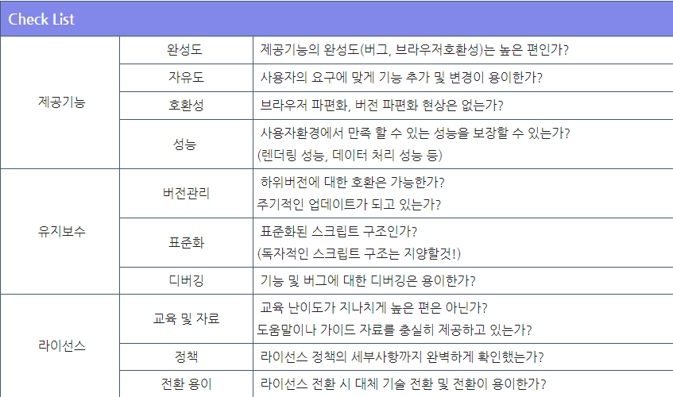

# JAVASCRIPT 프레임워크 비교분석
### 작성: 이찬영
---
## 프레임워크란?
 - 구조화된 스크립트를 통해 개발자의 스크립트 패턴을 정형화 
 - 반복적으로 해야 하는 공통부분을 최소화
 ### 세부 업무개발에 집중할 수 있으며 개발표준 준수 및 개발품질 향상에 도움을 준다
 ---
 ## 프레임워크의 장점

  - 체계적인 코드관리로 유지보수가 용이하다.
  - 기본설계 및 기능 라이브러리를 제공하여 개발 생산성이 높다
  - 코드에 대한 재사용성이 높다
  - 추상화된 코드 제공을 통해 확장성이 좋다

---

## 프레임워크의 단점

- 학습난이도가 높다.
- 기본 설계된 구조에 의해 자유로운 개발에 한계가 있다.
- 사용하지 않는 기능에 대한 라이브러리가 포함될 수 있다.
-  제공되는 기능만큼 프로젝트의 용량이 증가한다.
---
## 자바스크립트 프레임워크

 - 단순 스크립트의 단점
    - 그리드는 정렬, 컬럼 위치/사이즈변경 등의 기능을 순수하게 스크립트로 작업할 경우 복잡한 처리와 성능의 한계가 발생한다
    - 스크립트 표준 준수 및 개발품질 문제가 발생할 수 있으며 유지보수를 어렵게 한다
### 
  - 급변하는 UI 트랜드에 민첩한 대응이 가능하다고
  - 다양한 자바스크립트 프레임워크가 존재하는 만큼 장단점, 특징들 또한 다양하다
---

---
## Angular vs React vs Vue
 - 지난 10년 동안 엄청난 양의 자바스크립트 프레임워크가 등장했음에도 불구하고, Angular, React, 그리고 Vue가 여전히 가장 인기 있는 프레임 워크 이다.
 
 --- 
## Angular
 - 프런트엔드 JS 프레임워크의 과거 부터 현재까지 세계에서 가장 빠르게 수백만 명의 개발자들이 사용하는 주류 기술로 성장하였다.
 - 많고 빠른 릴리즈, 양방향 데이터 바인딩, MVC 모델, 내장 모듈 시스템, 라우팅 패키지 등의 다양한 기능을 제공
 - 작업을 논리 청크로 분할하여 웹 페이지의 초기 로딩 시간을 단축
 - 통신은 비동기 모드에서 작동하며, 이는 서버에 대한 호출이 더 적게 수행됨
 
 ---
## Angular 장단점

  - 장점
    - 양방향 데이터 바인딩: Angular 는 모델에 대한 변경사항을 쉽고 효율적이며 직관적인 방법으로 뷰에 즉시 복제한다.
    - Angular는 많은 커뮤니티와 전문직 종사자들이 지지하고 있어 현장에서 많은 트랙션을 가지고 있다.
  - 단점
    - 다른 프레임워크에비해 더 무거운 애플리케이션과 느린 성능
    - 지속적인 업데이트(무려 Angular11 까지 나왔다)
    - 가파른 학습 곡선: 다른 프레임워크에 비해 배우기 어렵다.
---
## React
 - 주로 상태정보 저장(Stateful) 및 재사용 가능한 UI 구성요소를 만드는 데 사용되는 프런트엔드 라이브러리.
 - 로드없이 데이터를 변경할 수 있는 대형 웹 애플리케이션 지원
 - 리액션을 사용할 때의 다른 큰 장점은 성능이다(43KB의 gzip)
 - 가상 DOM 사용:필요에 따라 노드만 다시 렌더링할수있다.
 - 번들링 및 트리 셰이킹 지원: 최종 사용자의 리소스 부하를 최소화
- 서버 측 렌더링(SSR) 지원
---
## React 장단점
  - 장점
    - Virtual DOM:  성능과 워크로드를 최적화할 때 많은 이점을 제공
    - 단방향 데이터 바인딩: 전체 프로젝트에 대한 더 나은 제어를 제공
    - 테스트가 용이함
  
  - 단점
    - MVC를 구현하지 않음: 추가라이브러리 필요
    - 문서화 불량: 빠른 업데이트로 기술문서작성X
    - 빠른 변화로 기술을 따라잡기 어렵다
---
## Vue.js
  - 사용자 인터페이스를 구축하기 위한 점진적인 프레임워크
  - 비교적 쉬운 학습 곡선 효율적이고 빠르고 정교한 단일 페이지 애플리케이션 생성  
  - Github에서 가장 주목받는 JS 프레임워크
  - 가상DOM, 반응형 복잡한 기능 제공

---
## Vue.js 장단점

  - 장점
    - 전체 성능이 높고 가볍다.
    - 사용 편의성: Angular와 같은 다른 프레임워크와는 달리 Vue는 배우기 쉽다.
    - 훌륭한 설명서: Vue 팀은 툴 설명서에 많은 노력을 기울렸다.
    - 간편한 프로젝트 통합
  - 단점 
    - 비교적 신기술로 커뮤니티가 약하다.
---
## 성능비교

|프레임워크 |DOM조작(ms)|시작시간(ms)|메모리할당(MB)|
|:---:|:---:|:---:|:---:|
|앵귤러|1.30|1.78|1.54|
|리액트|1.31|1.10|1.10|
|뷰|1.32|1.00|1.01|
--- 
## 앵귤러 를 언제 선택해야 하는가?
 - 매우 동적인 컨텐츠가 있는 앱
 - 대규모 엔터프라이즈급 애플리케이션
 ## 언제 리액트 을 선택해야 하는가?
 - 속도가 필요한 애플리케이션
 - 다용성이 필요한 애플리케이션
 - 좋은 SEO를 필요로 하는 일반 웹사이트
 - 국제적 페이지 
 --- 
 ## 뷰 는 언제 고를까?
 - 속도가 필요한 애플리케이션
 - 매우 가벼운 애플리케이션이 필요한 경우
 - 프레임워크를 기존 앱에 통합하려는 경우
 - 국제적 페이지 

