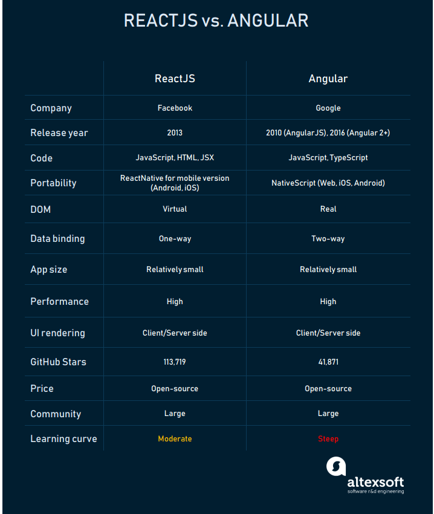
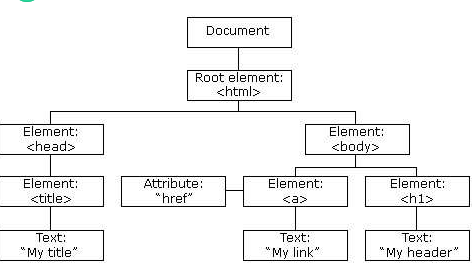
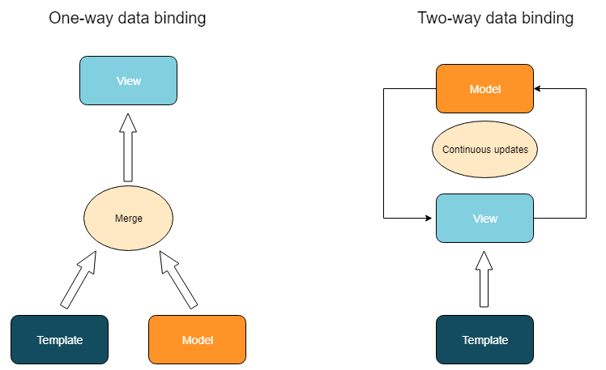
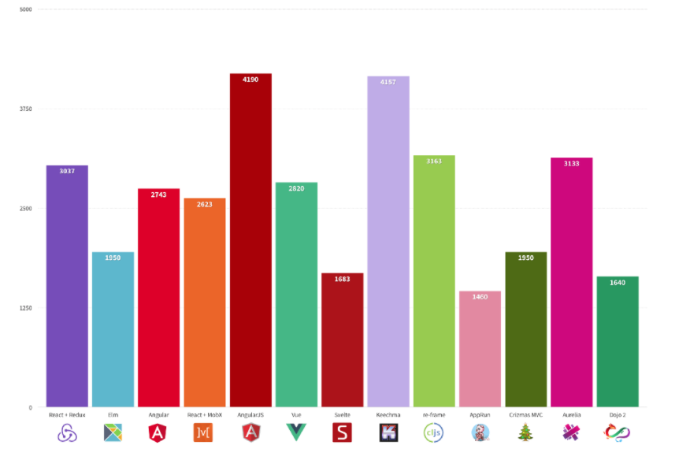

# 앵귤러 vs 리액트
### 작성: 이찬영
---

---

## Angular
  - RxJS :  비동기 프로그래밍용 라이브러리
  - Angular CLI : 강력한 Command-Line Interface
  - 의존성 주입( Dependency injection ) :병렬적으로 컴포넌트를 실행하도록 분리
  - Ivy renderer: 차세대 Angular 렌더링 엔진
  - Angular Universal: 서버 사이드 렌더링 기술
  - IDE : Aptana, WebStorm, Sublime Text, Visual Studio Code
  - 디버깅 도구: Jasmine, Karma, Protractor 
---
## React
  - Redux: 상태를 관리하는 컨테이너
  - Babel: JSX를 어플리케이션이 JavaScript로 변환,트랜스 컴파일러
  - Webpack: 관리를 위해 구성 요소를 Bundle로 묶어줍니다.
  - React Router:  표준 URL 라우팅 라이브러리
  - IDE:  Visual Studio Code, Atom, Sublime Text 
  - 유형별 테스트

---
React 테스트 tools
  - Enzyme /  Unexpected-react : 컴포넌트 테스팅
  - Jest :  자바스크립트 코드
  - react-testing-library : React DOM 테스팅
  - React-unit :  unit 테스팅
  - Skin-deep : Rendering Test utils
---
## Component 기반 구조
- 재사용 가능 및 유지관리 가능한 Component

## TypeScript vs. JavaScript and JSX
- TypeScript : JavaScript 상위 언어, 엄격하고 Type을 정하는 부분에서 실수를 발견, 빠른탐색, 자동 완성 및 더 빠른 코드 리팩토링
- JSX :  시각적으로 단순화,  Babel을 통해 브라우저 컴파일,  TypeScript와 거의 동일한 기능

---
## DOM: Real vs. Virtual
- DOM: 웹 문서의 내용 및 구조와 동적으로 상호 작용하고 이를 업데이트할 수 있는 트리 형태로 구성
- 가상 DOM은 변경 사항을 추적하고 전체 트리의 다른 부분에 영향을주지 않고 특정 요소 만 업데이트 (노드만 업데이트)

---
## Data Binding: 양방향 vs. 하향식 (단방향)

---
Angular: 양방향 데이터 바인딩
  - 모델과 뷰가 동기화: 데이터를 변경하면 뷰에 영향이 오게 되며,  뷰를 변경하면 데이터 또한 변경이 됩니다

React는 단방향 or 하향식  데이터 바인딩
  - 하위 Component가 업데이트될 때 상위 Component에 영향이 없다
  - 모델과 뷰를 동기화하기 위해서는 추가 작업
  - 예측 가능성이 높기 때문에 코드가 안정적이며 디버깅이 쉽습니다.
---
## 성능 

---
##  UI 디자인 요소
- Angular Material: 디자인 도구로 부터 
- React Community-Backed Components : 커뮤니티를 통한 무료/유료 컴포넌트

## 모바일 이식성
- NativeScript:  크로스 플랫폼 모바일 프레임워크
- React Native: NativeScript와 같은 기본 API 렌더링을 자랑하지만, 
---
## 문서 및 공급 업체 지원
 - AngularJS 문서 및 튜토리얼
 - React 커뮤니티
 
## 러닝 커브
  - Angular가 상대적으로 러닝커브가 가파릅니다.
  - 반복적인 행동이 필요하고, 복잡한 Component 관리
 