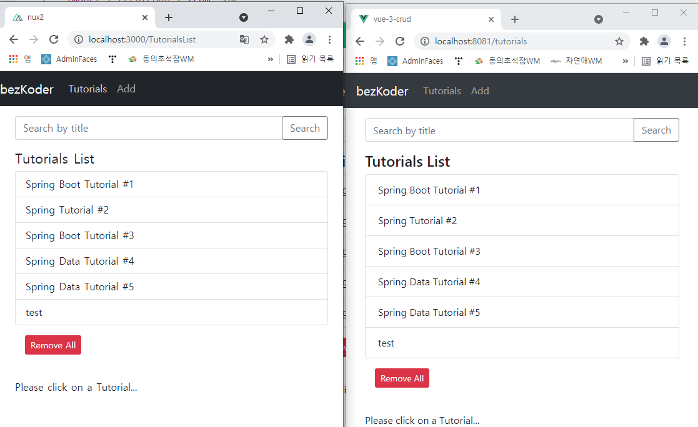

# NUXT.js 비교 분석
### 작성: 이찬영

---
### nuxt.js
 - Vue.js 응용 프로그램을 만들기 위한 Framework
 - SSR 방식을 제공하여 SEO 문제를 해결할수있다
 - vue 에서 모듈 설정등을 간단히 작성가능(nuxt.config.js)
 - Vue.js Application을 좀 더 손쉽게 만들 수 있다.
 ---
### 단점
- 문서화 불량, 모듈 등록방법은 쉬운데 정보 취득이 어렵다.
- js 디버깅 난이도로 인한 nuxt 설정 오류인지가 어렵다.
- vue.js 에 추가로  nuxt.config.js 설정방식 학습필요 
- nuxt 에서 제공하는 디렉토리 구성에서 사용자 커스텀 불가 
---
### 예제 프로그램 개발

---

### 예제 프로그램 개발
- 왼쪽은 nuxt.js 오른쪽은 vue.jsd으로 개발 되었습니다.
- bootstrap 모듈이 달라서 css상 차이는 존재하나 기능적 차이는 없습니다.
- nuxt.config.js는 모듈설정과 결로 지정에 있어서 이점이 있었다.
- 또한 기본적으로 vuex 와 라우터등 을 자동으로 생성해주기 때문에 큰이점있다.
- 하지만 nuxt 개발 구조에 맞춰 개발해야하는 환경상 자유도와 호환성 측면에서는 불편함을 제공한다고 생각한다.
