# JSF 인수인계
### 작성: 이찬영
수정일: 2021-07-19

---
## 개발 환경
- Spring boot
- Spring boot Security
- JSF
- JoinFace
- primeFace
---
## Spring boot
 - 스프링 프레임워크에서 사용자에게 간편한 기능이 많이 추가되어 개선된 시스템
 - 개발 편이성이 많이 올라가 스프링 부트를 도입하였다. 
## Spring boot Security
 - 보안및 권한 스프링 부트 라이브러리로 사용자 인증기능 과 현재는 활용되고 있지는 않지만 페이지/버튼 접속/접근 권한 체크 기능을 구현할수 있다.
---
## JSF
-  자바 서버 페이스라는 자바EE 기반 에플리케이션에서 UI 개발의 편의기능을 포함한 컴포넌트 기반 웹 에플리케이션 프레임워크
- 탄생배경:
  - 스트럿츠라는 자바웹에플리케이션 개발플레임워크가 존재
  - 루비온 레일즈등의 프레임워크등의 유용한기능을 자바로 흡수하기위해 스트러츠2가 개발됨
  - 스트럿츠 개발자들의 의해서 발전된 JSF가 개발됨
---
## JoinFace
- 스프링부트와 JSF를 묶어주는 자바 라이브러리
- 기본적으로  view와컨트롤은 JSF의 컴포넌트형식으로 구현
- model은 스프링의 디비연동기능으로 개발 하며 스프링의 유용한기능을 도입가능하다.(UI 적인것을 제외하고)
## primeFace
- JSF의 UI 컴포넌트 라이브러리로 많은 유용한 컴포넌트를 제공한다.
---
# 프로젝트 자바 파일 구조


---
# com.himes.food
  - 스프링 부트 세큐리티 설정 자바 파일 
  - 보안설정 및 권한설정등 기능을 구현한다.


---

---
### SecurityConfig.java
- confirgure() 함수를 오버라이딩하여 로그인 방식 접근제한 범위등을 지정 할수있다.
- 참고(https://spring.io/guides/gs/securing-web/)
### CustomAuthenticationProvider.java 
- 인증 처리 과정을 커스텀하여 사용할수있다.
- authenticate를 오버라이딩하여 사용자계정정보에 맞게 커스텀됨
---
### HimesEncoder.java 
 - 비밀번호를 암호화를 진행
 - 암호화된 비밀번호와 디비상 비밀번호와 같은지 확인
### UserLoginSuccessHandler
 - 인증성공 이벤트 핸들러
 - 인증후 홈페이지를 지정하거나 로그인 로그 처리를 진행
---
## Model


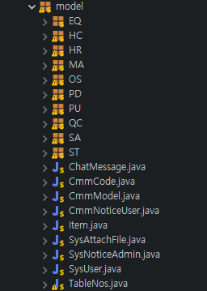

--- 
- C#의  ibatis 와 동일하게 모델을 통해서 데이터베이스와 통신합니다.
- cmmModel 상속받아 getRowKey() 등의 공통함수를 가져와야한다.
- @Data 를 활용하면  @getter, @setter를 작성한거처럼 자동으로 생성이 됩니다.(함수구현 필요X)
- @NoArgsConstructor 로 기본 생성자를 자동으로 생성합니다.
---
## StDailyStockHs.java
````
@Data 
@NoArgsConstructor
public class StDailyStockHs extends CmmModel {
	/// 법인일렬번호
	public int CompSeq;
	/// 일자
	public Date Date;
	/// 품목일렬번호
	public int ItemSeq;
	/// 재고수량
	public int StockQty;
	/// 가용재고수량	
	public int AvailableQty;

 ////...... 생략......///

````
---
## DAO
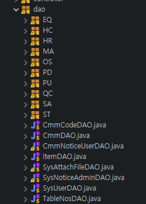

---
- C#에서의 dao 와 동일한 기능
-  반드시 mapper 의 쿼리 ID 와 DAO의 함수명이 같아야한다.
- CmmDAO를 상속받아 자주 사용하는 함수명(select,update 등)을 가져올수도 있다
- DAO 클래스를 모델 타입을 지정하여 상속  받습니다.
- 모든 Dao 는하나의 mapper 와 연결 되므로 반드시 1대1 맵핑이 되어야 합니다.

---
### StDailyStockHsDAO.java

````
@Repository
@Mapper
public interface StDailyStockHsDAO extends DAO<StDailyStockHs>{
}
````
---
## Service
 
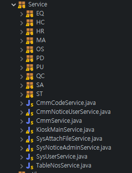

---
- C#의 Service 와 같은 기능을 하는 클래스 입니다.
- Dao 와 view  사이에서 데이터를 전달 합니다.
- CmmService를 통해 자주사용하는 함수를 상속받습니다.(멤버타입지정 필요)
- @Autowired 사용하면 Dao 빈과 자동으로 연결해준다.
- init() @PostConstruct를 사용하여 생성이전에 실행되어 dao를 초기화 해준다. 
---
### StDailyStockHsService.java
````
@Service
public class StDailyStockHsService extends CmmService<StDailyStockHs>{
	
	@Autowired
	private StDailyStockHsDAO sdshDao;
	  
	@PostConstruct
	void init(){
		dao = sdshDao;
	}
}
````
---
## Mapper
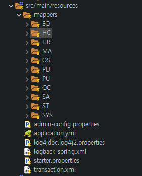

---
- 디비의 쿼리를 관리할 mapper.xml 입니다.
- C# 과는 기본 설정과 태그가 조금 다릅니다.
- application.yml 에서 디비연결정보를 관리 한다.
---
## CarMapper.xml
 ````
<mapper namespace="com.himes.food.dao.CarDAO"><!--namespace를 통해 DAO와 연결합니다. -->
  <select id="selectList" parameterType="com.himes.food.model.Car" resultType="com.himes.food.model.Car">
  <!-- Select()메서드를 호출하면 실행할 SELECT문이며,  model 객체를 파라미터로 받아, model객체를 반환합니다.-->
  	SELECT id, brand, year,color
    FROM Car
    <!-- 만약 파라미터에 country가 있다면 SQL문에 WHERE절을 추가합니다. -->
    <if test='year != null and year != ""'>
    	WHERE year = #{year}
    </if>
  </select>
</mapper>
 ````
 ---
## Mybatis
    - if
    - choose, when, otherwise
    - trim, where, set, 
    - foreach
    - script, bind, Multi-db vendor support
    - Pluggable Scripting Languages For Dynamic SQL
- URL: [MyBatis - 마이바티스 3 | 동적 SQL](https://mybatis.org/mybatis-3/ko/dynamic-sql.html)
---
## View 
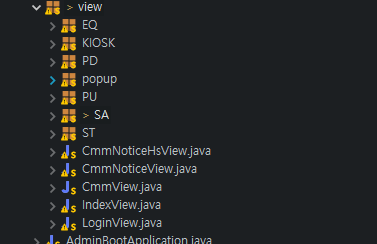

---
- C#의 UI에서 controller 기능을 수행 합니다.
- backing bean으로 UI에서 기능을 처리한다.
- Xhtml 파일에 value를 제공하고
- Cmmview를 상속을통해 공통기능을 받아온다.(팝업처리..등)

---
## MVC Architecture
 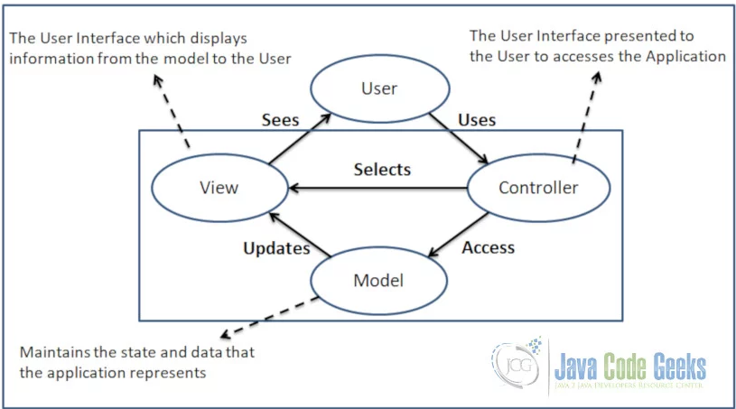

---
## JSF MVC Architecture
 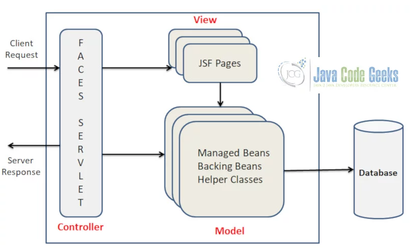
---
## StDailyStockHsView.java
````
@Named
@ViewScoped
@Getter
@Setter
public class StDailyStockHsView extends CmmView {

    //  
	@Autowired
	private StDailyStockHsService sdsh_Service;
	private List<StDailyStockHs> sdshList ;
	StDailyStockHs sdsh = new StDailyStockHs();
  
  // 초기화 함수 
	@PostConstruct
	public void init() {
````
---
## JSF pages
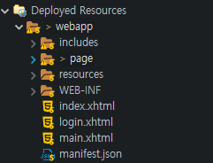

---
 - xhtml 파일로 구현
 - xmlns로 지정 한 다양한 태그를 활용하여 화면단을 구현 합니다.
 - primeface component를 활용하여 구현 하였습니다. 
 ````
 <?xml version="1.0" encoding="UTF-8"?>
<!DOCTYPE html PUBLIC "-//W3C//DTD XHTML 1.0 Transitional//EN" "http://www.w3.org/TR/xhtml1/DTD/xhtml1-transitional.dtd">
<html xmlns="http://www.w3.org/1999/xhtml"
	xmlns:h="http://java.sun.com/jsf/html"
	xmlns:p="http://primefaces.org/ui"
	xmlns:f="http://java.sun.com/jsf/core"
	xmlns:c="http://xmlns.jcp.org/jsp/jstl/core"
	xmlns:ui="http://xmlns.jcp.org/jsf/facelets">
 ````
 ---
# JSF pages 
 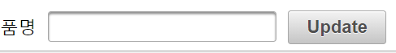

 ````
<h:form id="form">
    <p:outputLabel value="품명" />
	<p:inputText value="#{stDailyStockHsView.sdsh.itemNm}" />
    <p:commandButton value="Update" action="#{stDailyStockHsView.searchBtnAction}" 
        update="mainTable"process="@all" />
</form>
 ````
---
# JSF pages
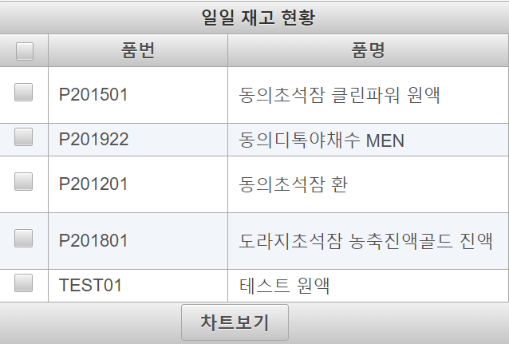

---
## JSF pages 
```
<p:dataTable id="mainTable" var="StDailyStockHs" styleClass="dataTable" 
    value="#{stDailyStockHsView.sdshList}" selection="#{stDailyStockHsView.selectedSdsh}"
    rowKey="#{StDailyStockHs.itemNo}" style="margin-bottom:0">
    <f:facet name="header"> 일일 재고 현황 </f:facet>
    <p:column selectionMode="multiple" style="width:16px;text-align:center" />
    <p:column headerText="품번" styleClass="itemNo">
        <h:outputText value="#{StDailyStockHs.itemNo}" />
    </p:column>
    <p:column headerText="품명" styleClass="itemNm">
        <h:outputText value="#{StDailyStockHs.itemNm}" />
    </p:column>
    <f:facet name="footer">
        <p:commandButton value="차트보기" action="#{stDailyStockHsView.createLineModels}" 
            update="mainChart"process="mainTable" />
	</f:facet>
</P:dataTable>
```
---

# JSF pages
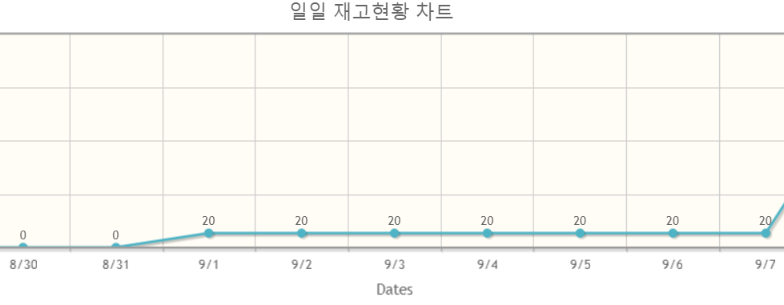

````
<p:chart id="mainChart" type="line"
			model="#{stDailyStockHsView.getLineModel()}" style="height:300px;" />
````
            
---
# menu.xhtml

````
	<ui:include src="./menu.xhtml"></ui:include>
````
````
<ui:composition xmlns= "">
 <h:form>
    <p:menubar>
        <p:submenu label="재고관리"  icon="pi pi-briefcase">
            <p:menuitem  value="재고현황(일일)" url="./StDailyStockHs.xhtml" />
        </p:submenu>
    </p:menubar>
 </h:form>
</ui composition>
````
---
## JSF 파일구조


---
## includes
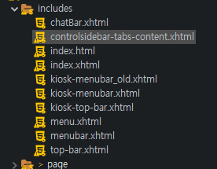

---
- 공통 UI를 한번에 관리한다.
- chatBar.xhtml : 채팅기능 UI 
- kiosk-menubar.xhtml : 키오스크용 메뉴
- kiosk-top-bar.xhtml : 키오스크용 탑바
- menu.xhtml : 일반 화면용 좌측메뉴
- top-bar.xhtml : 일반 화면용 탑바
---
## template
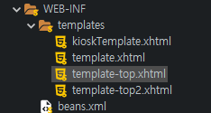

---
- 템플렛으로 해당 파일을 바탕(뼈대)로 하나의 페이지를 만든다.
- kioskTemplate.xhtml : 키오스크용 
- kioskTemplate.xhtml : 일반 화면용
- 내부구조
  - head : html 헤더의 역활
  - logo : 로고 정보
  - menu : 메뉴파일을 인크루드한다.
  - top-menu : 탑바파일을 인크루드한다.
  - footer : footer 정보 입력(Copyrightⓒ by ....)
---
## page 
- 화면 하나의 단위로 page 하나당 화면 하나로 볼수 있다.
- `<ui:composition> ~ </ui:composition>` 사이에 구현 
-  template = "키오스크 템플렛" or "일반 템플렛"
- ui-metadata: 제목, css 파일,js 파일 임포트
- ui-description : 페이지 기능 설명(부제목)
- ui-body: 화면 기능 구현

---
## 기타 설정 파일 (pom.xml)
-maven 설정파일
```
<dependency>
	<groupId>org.joinfaces</groupId>
	<artifactId>primefaces-spring-boot-starter</artifactId>
</dependency>
<dependency>
	<groupId>org.springframework.boot</groupId>
	<artifactId>spring-boot-starter-web</artifactId>
</dependency>
<dependency>
	<groupId>org.springframework.boot</groupId>
	<artifactId>spring-boot-starter-security</artifactId>
</dependency>
```
---

## 기타 설정 파일 (application.yml)

````
server:
  port: 8080

spring:
  datasource:
    url: jdbc:mariadb://hidatajinju.iptime.org:3306/himes_food
    username: hidata
    password: jinju7639998

mybatis:
# mybatis 매핑 type을 짧게 쓰기 위한 설정
  type-aliases-package: com.himes.food.model
  mapper-locations:
  - classpath:mappers/*.xml
````
---
