# Vue 인수인계
### 작성: 이찬영
2020-07-20

---
## 구현 방식
 - 서버 : Spring boot
 - 프론트엔드: Vue,PrimeVue
## 개발환경 
  - 프론트엔드: vscode, node.js(v16.1.0)
    - node.js 설치: https://nodejs.org/en/
---
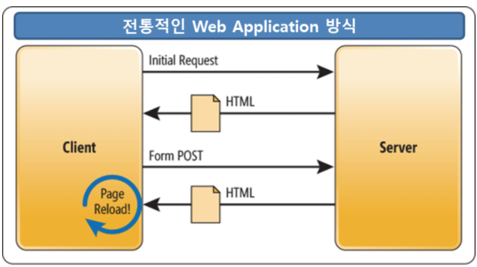

---
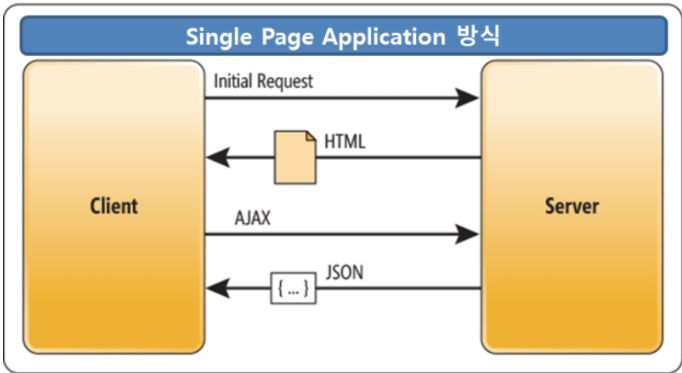

---

## SPA 의 특징
 - SPA란?
	- 서버로부터 새로운 페이지를 불려드리지 않고 문서를 동적으로 다시작성하는 기술 
	- 새로고침이 없고 DOM 부분만 갱신할수있다.
- 라우팅
	- 화면전환을 위한 네이게이션으로 URL을 해석하여 해당화면을 구성한다. 
	- 라우팅을 백단이 아닌 브라우저에서 구현하는것이 핵심기능이다. 
	- 요청에따라 돔을 동적으로 생성하여 문서내용을 변경한다.(랜더링 된다.)
---
## 컴포넌트
- 특정부분만 바인딩하는 개념 
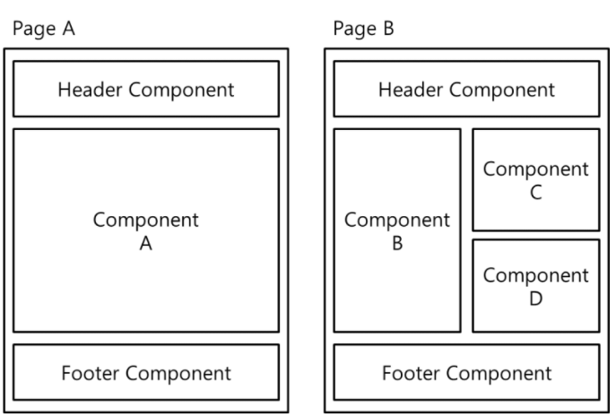
---
## SPA 의 장점
 - 네이티브 앱과 개발/결과 유사
 - 리소스 다운 1회만 진행
 - 트레픽 감소
 - 새로고침 없음
 ## 단점 
 - 최초 구동느림
 - 검색엔진 최적화 이슈 존재
---
## 개발 환경 설치
1. Node.js 설치 (16.x.0 최신버전으로)
    - [설치링크](https://nodejs.org/ko/)

2. vscode 설치
    - [설치링크](https://code.visualstudio.com/)
    - Extention 추천(편리한 확장프로그램)
        - [Korean Language Pack](https://marketplace.visualstudio.com/items?itemName=MS-CEINTL.vscode-language-pack-ko), [디버깅크롬](https://marketplace.visualstudio.com/items?itemName=msjsdiag.debugger-for-chrome), [화이트테마](https://marketplace.visualstudio.com/items?itemName=akamud.vscode-theme-onelight)
3. vue-cli 설치
    -cmd창에 ``` npm install -g @vue/cli ``` 입력
---
4. sts 설치(4.x.0 최신버전)
    -[설치링크](https://spring.io/tools)
5. 설치 완료후 sts.jar 실행 
    - 만약 자바 설치 되어 있지 않다면 설치 
        - [설치링크](https://java.com/ko/download/ie_manual.jsp?locale=ko)
6. java 를 통해 sts.jar 실행 
 ```
  >java -jar sts.jar
 ```
 ---
7. sts 실행
8. window-> perspective->open perspective ->other

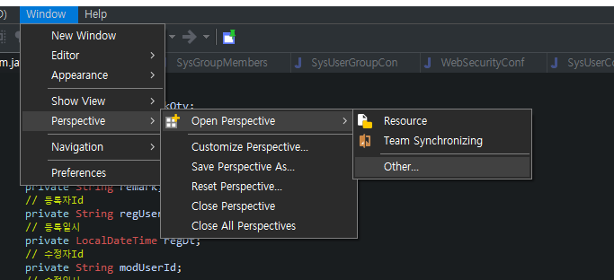

---
9. Git 선택

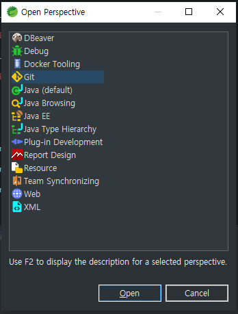

 ---
 10. git-perspective 로 이동

 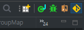

 11.Git Repositories 에서 왼쪽 클릭-> Clone a Git ....

  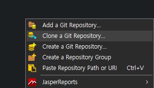

 ---
 12. URL 입력 (http://hidatajinju.iptime.org:10080/GIT/springboot_vue.git)

 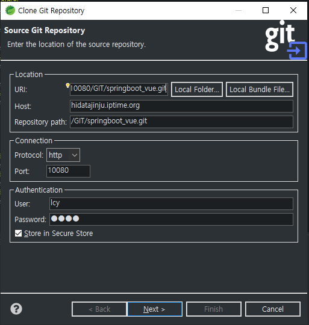

 ---
 13. Next->Next
 14. Directory 에 원하는 위치를 지정

 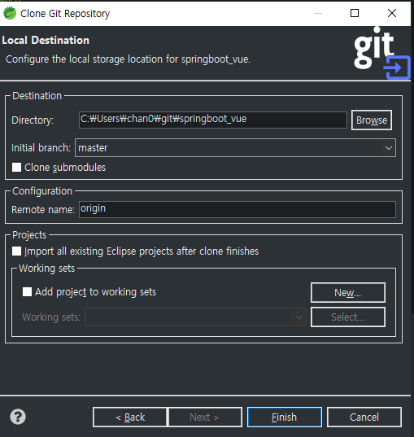
 
 ---
 ## 이클립스 깃 관리 
 1. 커밋: 프로젝트 왼쪽 클릭-> team-> commit
  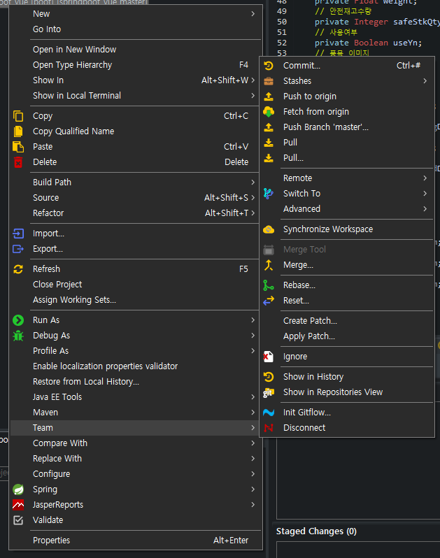

---
1. 커밋 메세지 입력후 커밋
  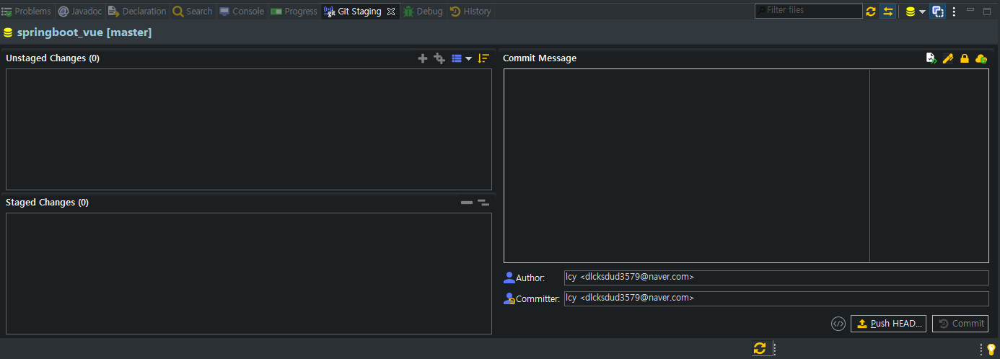
---
### PULL/PUSH


---
push: 프로젝트 왼쪽 클릭-> team-> push
    - 깃 저장소로 업로드 

pull: 프로젝트 왼쪽 클릭-> team-> pull
    - 깃 저장소로 부터 최신 데이터 다운로드

Fetch: 프로젝트 왼쪽 클릭-> team-> fetch
    - 깃 저장소로 부터 최신 데이터 확인

---
## 프론트 엔드 개발
1. vscode 실행하기
2. ctrl+O(폴더열기) 설치경로의 frontend 파일 선택  
3. 터미널 창에 입력
```
>npm i(install)
>npm run serve
```

4. 배포비 
```
>npm run build
```
---
### JAVASCRIPT 프레임워크
- 구조화된 스크립트를 통해 개발자의 스크립트 패턴을 정형화 (유지보수 ,재사용성 )
- 반복적으로 해야 하는 공통부분을 최소화 
- 프론트 엔드 프레임 워크 이기 때문에 서버 가 아닌 클라이언트 에서 많은 기능을 개발 함 (서버 부담 감소)
- 기본설계 및 기능 라이브러리를 제공하여 개발 생산성이 높다
- 추상화된 코드 제공을 통해 확장성이 좋다

---
### Vue
- 사용자 인터페이스를 구축하기 위한 점진적인 프레임워크
- 비교적 쉬운 학습 곡선 효율적이고 빠르고 정교한 단일 페이지 애플리케이션 생성  
- Github에서 가장 주목받는 JS 프레임워크
- 가상DOM, 반응형 복잡한 기능 제공
- 외부 라리브러리 채택,빠르고 가벼움(18KB GIP)
---
### vue 템플렛 스타일 
```
<template>   
    <div>
        ....  // html or  컴포넌트  UI 구현
    </div>
<template>

<script>  
import .... form  ...  // 외부 파일 임포트
export default{ ... }  // 기능 구현 
</script>

<style scoped lang="scss">  // 스타일 구현 scss 로 css 의 포합집합
...
</style>
```
---
### template
```
<template>   
    <div>
        ....  // html or  컴포넌트  UI 구현
    </div>
<template>
```
 - 반드시 `<template>`중간에 하나의 `<div>` 가 필수
 -  html 테그 들과 여러 컴포넌트를 임포트하여 사용할수있다.
 - `<form>` 는 따로 사용 하진 않음
 - primeVue의 UI컴포넌트를 사용할 예정
 - [primeVue](https://primefaces.org/primevue/showcase)

---
### script
```
<script>  
import .... form  ...  // 외부 파일 임포트
export default{ ... }  // 기능 구현 
</script>
```
- 필요한 공통기능들은 외부 js 파일로만들어 import해오는 방식
- 컴포넌트 파라미터, 이벤트 콜백함수등 구현해야한다.
-  Composition API를 사용하여 개발할 예정
- layout 컴포넌트는 Options API 구현 되어 있다.(수정 필요?)

---
### Composition API란?
- 2020년 4월 19일 vue.js 3.0 배타 번전에서 추가된 새로운 방식의 API
- 기존의 방식인 Options API의 단점을 보완하기 위해 주로 사용된다.
- 기존의 mixin(재사용 기능), 오버라이딩 문제 해결
- 컴포넌트 관리가 쉬워진다.
---
### Options API vs Composition API
```
<template>
    <div>
        <h1>Count: {{ count }}</h1>
        <h1>Double: {{ double }}</h1>
        <button @click="increase">increase</button>
        <button @click="decrease">decrease</button>
    </div>
</template>
```
----
### Options API
```
<script>
export default {
    data () {
        return { count: 0,}
    },
    methods: {
        increase () { ++this.count; },
        decrease () { --this.count; }
    },
    computed: {
        double () {return this.count * 2; }
    }
}
</script>

```
---
### Options API
- 기능을 가진 로직들이 data, methods, computed로 각각 분리된다.
-  로직이 많아지게 되면 여러 라이프사이클 훅에 로직들이 흩어지게 된다.
- 따라서 가독성 떨어진다.
---
### Composition API
```
<script>
import { reactive, computed } from '@vue/composition-api';
const useCount = () => {
    const count = ref(0);
    const double = computed(() => count.value * 2);
    const increase = () => ++state.count;
    const decrease = () => --state.count;
    return { count, double, increase, decrease }
}
export default {
    setup () {
        const { count, double, increase, decrease } =useCount();
        return { count,double,increase,decrease}
    }
}
</script>
```
---
### Composition API
- 분산된 로직 문제를 해결로 가독성 증가
- setup을 통해서 초기화를 진행
- 라이프사이클 변화 (ex. mounted -> onMounted ,...)
- 신규 훅 (onRenderTracked, onRenderTriggered)
- this.$ 으로 접근하던 (ex. this.$router,this.$refs) 등을 this 없이 setup() 에서 받아서 사용
---
 ## 반은형 이란?
- vue에는 비간섭적인 반응성 시스템이 존재한다.
- vue에서 모델은 Model은 프록시로 감싸진 자바스크립트 객체입니다. 
- 모델을 변경하면 화면이 바뀐다.
- 따라서 반응성 시스템은 어플리케이션의 상태관리를 단순하고 직관적으로 만듭니다.

---
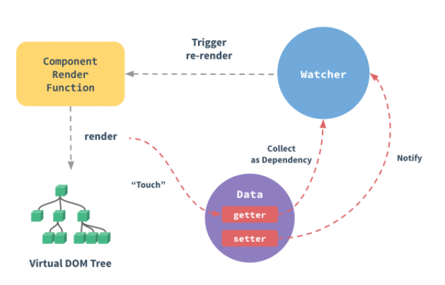

 --- 
 ## 기존방식
  - 값 중 하나라도 변경되는지 여부를 감지합니다.
  - 값을 변경하는 함수가 호출되는지 추적합니다.
  - 함수를 호출하여 변경을 발생시켜 최종 값을 갱신합니다
---

 ## vue 방식
  - 자바스트립크 객체를 data옵션으로 어플리케이션이나 컴포넌트 인스턴스에 전달하면, Vue는 주어진 객체의 모든 프로퍼티를 프락시(Proxy)로 변환
  -  프락시(Proxy)는 다른 객체나 함수를 감싸는 객체이며, 원본으로의 호출을 중간에 가로채서 처리할 수 있게 합니다.
 - 자세한 내용 https://v3.vuejs-korea.org/guide/reactivity

---
- 컴포넌트의 data 에 변경을 해줘도 props 로 자식에게 전달해준 값이 갱신되지 않는문제를 해결해준다.
- vue가 컴포넌트 인스턴스의 data 속성 값을 추적하여 화면에 랜더링하는 방법
 - 인스턴스마다 할당된 watcher 를 통해 변경 사항을 추적 및 관리한다.
 - 인스턴스 초기화 단계에서 data 의 모든 속성에 getter / setter 를 생성
 - DOM 업데이트의 비동기 수행
    - 모든 데이터 변경을 버퍼에 기록(큐)
    - 이벤트 루프 tick 에서 변경 작업을 수행
---
### reactive
```
const getObject = reactive({ index: 1, index2: 2});
console.log(getObject.index) //1 
console.log(getObject.index2)//2
``` 
 - reactive는 반응형 상태를 선언해 주는 역할
 - 객체만 받을 수 있도록 되어있고, 인자로 받은 객체와 동일한 프록시 객체를 반환
 - 기존방식의 Vue.observable()와 동일한 객체가 생성
 ---
 ### ref
 ```
 const count = ref(0)
console.log(count.value) // 0

count.value++
console.log(count.value) // 1
 ```
- ref는 내부 값을 가져와 반응, 변경 가능한 객체를 반환합니다.
- ref 객체에는. value로 내부 값에 접근할 수 있습니다.
- reactive의경우는 여러 속성을 가지고 모두 추적하지만 refs는 단하나의 속성(vlaue)만을 추적한다. 
---
### 템플릿에서 액세스
```
<template>
    <div>{{ count }}</div>
</template>

<script>
export default {
    setup() {
        return {count: ref(0)}
    }
}
</script>
```
---
### readonly
```
const original = reactive({ count: 0 })
const copy = readonly(original)
original.count++
copy.count++ // warning
```
- 반응형 객체의 변이 방지
---
### computed
```
const count = ref(1);
const plusOne = computed(() => count.value + 1);

console.log(plusOne.value); // 2
plusOne.value++; // error
```
- getter 함수를 가져오고 getter에서 반환된 값에 대한 변경 불가능한 반응성 참조 객체를 반환합니다.(계산된 값)
- gett 및 set 함수가 있는 객체를 사용 가능
---
### watchEffect
```
const count = ref(0)
watchEffect(() => console.log(count.value))// -> logs 0
```
 - 반응형 상태에 따라 사이드 이펙트를 적용
 - 차이점 
    - 감시종료 ,이펙트 무효화
    - 디버깅등 추가기능 지원
---
### watch
```
const state = reactive({ count: 0 })
watch(() => state.count,(count, prevCount) => {
    /* ... */
  }
)
```
- 특정 데이터 소스를 관찰하며 별도의 콜백 함수에서 사이드 이펙트를 적용
- 차이점
    - 지연 실행,구체적인 트리거구현 가능 
    - 변경전 값과, 변경후 값에 모두 접근 가능

---


## JAVASCRIPT 고급 문법
- java 랑 C# 이랑 다른게 JAVASCRIPT는 완전한스크립트 언어
- TypeScript 를 사용하지 않으면  변수타입 지정 이나 클래스/구조체 정의 없이 개발한다.
- TypeScript는 JAVASCRIPT의 상위 집합으로 모든 기능 + 클래스기반 객체지향기능 + 변수 타입지정

---

## then()
```
service.getList().then(data => list = data)
service.getList().then(data => {...})
service.insertOne().then(() => {...})
```

 - then() 메서드는  Promise(비동기작업의 결과?)가 이행 하였을때의 콜백 함수
 - 'data' 으로 함수 리턴 결과를 가져 오거나 리턴이 없으면 () 으로 사용
 - [참고문서](https://developer.mozilla.org/ko/docs/orphaned/Web/JavaScript/Reference/Global_Objects/Promise/then)
---
## then()
```
service.getList().then(data => list = data)
log(data.value)  // 결과 null  then() 보다 먼저 실행된다.
```

 - 비동기실행이 이행이 기때문에 코드순서대로 진행되는것이 아님! 따라서 log()의 결과는 조회내용이 반영되지 않는다.
 - 만약 비동기 실행이 끝나고 실행되길 원한다면 then() 메소드안에 {} 사이에 정의할것!
 
---
## foreach()
```
const list = ref([]); 
list.value.foreach(e=>
    {
        ....
    })
```
- 리스트 내용을 반복 실행할경우 사용된다.
- for문에 비해 빠르고 구현 쉬워 자주 사용됨
- 'e' 는 명칭은 변수구칙에 맞게 지정하면된다.
- [참고문서](https://developer.mozilla.org/ko/docs/Web/API/NodeList/forEach)
---
# find()/findIndex()/fiter()
```
var list = [2,3,2,5,6]
list.find(e=> e == 2 ) // 2 ,가장 첫번째 결과를 찾아서 리턴
list.findIndex(e=> e == 2 ) // 0 ,첫번째 결과의 Index 를 리턴
list.fiter(e => e == 2 ) // [3,5,6] , 해당하는 데이터를 필터링 
list.includes(2) // true ,포함 여부 확인
```
- 리스트를 다룰때 자주 사용하는 메소드 함수
- 데이터 제거시 fiter() 를 사용하고 수정시 find() 사용
- 상태 체크시 includes() 사용

---
## Object 함수
```
var source = {key:"1",data:"test"}
const data = ref({}}
Object.assign(data.value,source);  // source 를 카피/복사 한다.
Object.keys(data);  //['key','data'],  data 멤버이름의 배열을 리턴
                    
```
- `data.value = source` 사용시 에는 복사가 아닌 포인터 복사이기 때문에 같은 객체를 가르키게 된다.
- data.value 가 수정 되면 source도 수정 되기 때문에 assign() 으로 복제 되어햐한다.

---
# 프로젝트 구현
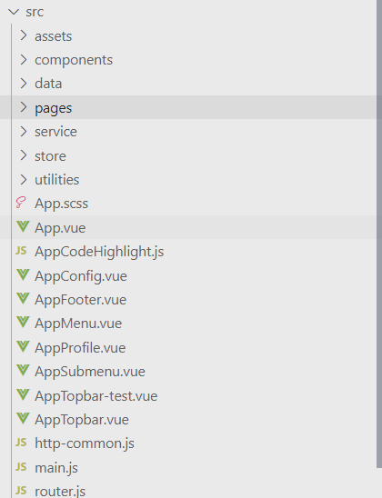

---
 - Page : .vue 로 구성된 템플렛 컴포넌트, 하나의 파일이 하나의 화면 or 컴포넌트를 구성한다.
 - Service : axios를 통해 http 요청을통해 서버와 rest api로 데이토를 주고 받는다. 
 - Utils : 유용한 전역 함수 or 도구 
 - router.js : url 과 컴포넌트(vue 파일)을 등록하여 화면을 등록하는 파일
 - main.js: 메인 파일로  프로젝트 에서 사용할 컴포넌트를 지정한다.
 - http-common.js:  axios의 상세 설정 파일, http 요청 설정 밑 에러 처리 함수 정의
 ---
 ## main.js

  ```
 // css 파일 임포트
import './assets/layout/flags/flags.css';
// 컴포넌트 임포트
import { createApp, reactive } from 'vue';
// vue 앱 생성
const app = createApp(App);
// 앱설정
app.use(router);
app.directive('badge', BadgeDirective);
// 앱설정-컴포넌트 설정
app.component('AutoComplete', AutoComplete);
// 앱 마운트  
app.mount('#app');
  ```
---
## router.js

```
const routes = [
    {
        path: '/simplePage(/:key)',  // URL 경로  (만약 키값을 가진 페이지를 따로 구현 할경우 :key 넣어 경로정보 입력) 
        name: 'simplePage',  // 페이지 이름 

        // 파일 경로
        component: () => import('./pages/simplePage.vue'), 
        meta:{title:'제목',sub:'부제목'}
    },
    // ...추가경로정보...
]
```
---
## http-common.js

```
const instance= axios.create({ .... }) //  http 요청시 던질 데이터의 상세설정을 할수있다. (header 등)

instance.interceptors.request.use(  //  요청직전에 실행 된다.
    function(config){....}  // config는 http 설정정보가 들어 있으며 config를 변경후 리턴해야한다.
    function (error) {....}  // 요청직전에 발생한 에러를 캐치

instance.interceptors.response.use( // 요청 직후에 실행
  function (response) {....}  // 요청의 결과(response)을 받아 수정/확인 후  리턴해야한다
  function (error) {....}  // 요청중 발생한 오류를 캐치

```

---
## ItemService.js
```

// HTTP 비동기 통신 라이브러리 임포트
import http from "../http-common"; 

export default class ItemService {
	// 데이터 목록 조회
	getList(_params) {
		return http.get('/items', { params: _params }).then(res => res.data.data);
	}
    // 데이터 조회
	getOne(_id) {
		return http.get('/items/'+_id.toString()).then(res => res.data.data);
	}
```

---

```
    // 데이터 입력
	insertOne(_data) {
		return http.post('/items',_data).then(res => res.data.data);
	}
    // 데이터 업데이트 
	updateOne(_id,_data) {
		return http.patch('/items/'+_id.toString(),_data).then(res => res.data.data);
	}
    // 데이터 삭제
	deleteOne(_id)
	{
		return http.delete('/items/'+_id.toString()).then(res => res.data.data);
	}
```

---

## vue 파일
```
<template>
 // html 입력, 화면or 컴포넌트의 틀을 구현 
 // EX) <Table> , <Button> 
</template>

<script>
// 스크립트 정보를 입력, 기능을 구현한다.
</script>

<style lang="scss" scoped>
// css 를정의 한다. 화면을 꾸미는 용도
</style>
```

---
## App.vue
- 페이지의 메인 레이아웃이 될 vue 파일
- 모든 페이지의 바탕(틀)이 될 화면
- 공통 기능이나 공통 컴포넌트를 정의 하고 구현한다.
- 레이아웃 컴포넌트/ 메뉴 구성정보로 구성된다.
- 메뉴 구성은 추후 디비 메뉴 정보로 수정 될수도 있다.

---
```
<AppTopBar ... />  // 상단 바 메뉴 컴포넌트
<transition ... >  // 좌측 사이드 메뉴 창 
....
    <AppProfile />   // 사용자 정보창의 컴포넌트 
    <AppMenu .../>  // 메뉴 컴포넌트 
</transition>
<div class="layout-main"> 
	<router-view /> // 페이지가 들어갈 공간
</div>

<AppConfig.../>  // 설정 창 레이아웃 컴포넌트
<AppFooter /> // Footer 레이아웃 컴포넌트
```
---
## 메뉴 데이터 구성

```
menu : [
            {label: '메인', icon: 'pi pi-fw pi-home', to: '/'},   // 하나의 메뉴 
            {label: '기초정보', icon: 'pi pi-fw pi-sitemap',
				items: [  // 하위 메뉴 
					{label: '품목 관리', icon: 'pi pi-fw pi-circle-off', to: '/ItemsPage'},
					{label: '거래처 관리', icon: 'pi pi-fw pi-circle-off', to: '/CustsPage'},
				]
			},
```
---
## 레이아웃 컴포넌트
- AppConfig.vue : 설정 창 컴포넌트 / 색변경, 테마변경 기능
- AppFooter.vue : 하단에 업체 정보등을 작성하는 Footer
- AppMenu.vue  : 메뉴 기능 구현
- AppSubMenu.vue : 메뉴의 서브 메뉴기능을 구현 (페이지 이동메뉴)
- AppTopbar.vue :  상단바 기능을 구현 (페이지 제목 출력)

---
## page 개발 
 -  primeVue 컴포넌트를 활용하여 개발
 - src/page/모듈 폴더에 저장 하며 router.js 등록 해야한다.
 - 메뉴 등록은 메뉴 등록 페이지에서 등록
 - Composition API로 구현 진행 

---
## Button
```
<Button label="New" icon="pi pi-plus"
  class="p-button-success p-mr-2" @click="clickListener" />
 ....
    const clickListener = () =>{ .. } // click 이벤트 콜백함수
```
 - v-on: 이벤트 핸들링 콜백함수를 지정할수이있다. 줄려서 '@'로 표현한다. 
    - @click(클릭 이벤트)
    - clickListener : 클릭 이벤트 콜백함수
- [참고문서](https://primefaces.org/primevue/showcase/#/button)
---
## DataTable
 ```
  <DataTable  :value="dataList">
    <Column  field="id" header="ID" />
    <Column  field="name" header="이름" />
  </DataTable>
.....
    const  dataList = ref([{id:"1" ,name:"홍길동" },{id:"2" ,name:"홍길동" }]) 
 ```
  - v-bind: 는 데이터를 바인딩 한다는 표시로 컴포넌트에 데이터를 입력하는것이다 줄여서 ':' 로 표현된다.
  - ref()로 정의된 반응성 데이터를 bind 하여 변경을 추적!
  - [참고문서](https://primefaces.org/primevue/showcase/#/datatable)
---
## Form 
```
<InputText v-model="data.name"  />
<Checkbox v-model="data.useYn" :binary="true" />
<InputNumber v-model="data.age" />
<Dropdown v-model="data.car" :options="cars" optionLabel="brand"/>
....
const data = reactive({name:"",useYn:true,number:0, car:null})
var cars = [{brand:"현대", ...},{brand:"쌍용", ...},....]
```
 - v-model: 데이터를 입력받을 js 변수를지정 해야한다. (update 이벤트 포함)
 - reactive 사용하면 편하게 반응성 데이터 묶음 정의 가능 
 - cars 는 Dropdown의 선택지
 ---
 ## Js 구현 

 ```
<script>
import { ref, onMounted } from 'vue';
import UserService from '../service/UserService';
import CmmCodeService from '../service/CmmCodeService';
import JsUtils from '../utilities/JsUtils';
export default {
	setup() {
        onMounted(() => {
            // DOM 마운트시 실행될 함수, 데이터 초기화한다. 
        }
        //  js 스크립트 구현
    }
 ```

- 필요한 컴포넌트 모두 임포트한다.

---

 ## js 구현 규칙

 ```
 const compSeq = 1; // 상수로 사용할경우 
 const users = ref(); // 반은성으로 상용할경우
 const searchUseYn = ref(null); // 값 초기화
 const columns = ref([   // 배열 선언 
            {field: 'UserId', header: '아이디'},
            {field: 'FullNm', header: '성명'},
        ]); 
const clickSearchBtn =()=>{ } // 함수 선언

// 외부에 바인딩 하기위해서는 리턴에 포함되어야한다.
return { users ,searchUseYn, columns,clickSearchBtn } 

 ``` 
---
### Toast
```
    <Toast/>
    ....
    import { useToast } from 'primevue/usetoast';
    const toast = useToast();
    toast.add({severity:'success', summary: 'Successful',
         detail: 'Item Created', life: 3000});
```
 - 좌측 상단에 메세지를 띄울경우 alert() 대신 사용하기 좋다.
 - `<Toast/>`을 탬플릿에 넣어야하며 useToast()를 사용
 - severity는 (success/info/warn/error) 가있다.
 - [참고문서](https://primefaces.org/primevue/showcase/#/toast)
---
### ConfirmDialog
```
    <ConfirmDialog/>
    ...
    import { useConfirm } from 'primevue/useconfirm';
    const confirm = useConfirm();
    confirm.require({
        message:`해당 메뉴를 삭제하시겠습니까?`,
        header: '메뉴 삭제',
        icon: 'pi pi-exclamation-triangle',
        accept: () => {
            deleteData(prod);
        },
        reject: () => {
            ...
        }
    })
```
---
- 기능을 실행하기전 사용자에게 확인 받는 기능(정말로 진행하시겠습니까?)
- `<ConfirmDialog/>`을 탬플릿에 넣어야하며 useConfirm() 사용
- accept: 사용자가 승인시 실행되는 파트
- reject: 거절 될시 실행될 파트
- message/header/icon 으로 다이알로그의 텍스트 와 아이콘을 변경 가능하다.
---
## Router
- 서버를 통한 페이지 요청없이 하나의 페이지에서 경로 요청에따라 DOM 을 변경시키는 기술
- 사용자가 URL를 요청하면 해당 URL에 해당하는 Router 정보를 확인하고 해당 page를 돔에 마운트 한다.
- 따라서 router 정보를 입력하여야 한다. (Router.js 참조)
- 등록되지않는 URL 경로는 접근이 불가능 하다.
---
## use route/router
```
import { useRoute } from 'vue-router'
import { useRouter } from 'vue-router';
const router = useRouter();
const route = useRoute(); // 현재 라우터정보 접근
log(route.params.id) // URL 파라미터 
router.push({name: 'NewItemPage', params: {}}) // 페이지이동
router.addRoute({path: '/test',name: 'test', 
    component: () => import('./pages/demo/InputDemo.vue')}) // 페이지 등록
```
- route: 현재의 라우트 정보를 확인
- router: 메소드함수로 라우터를 관리(ex. push(): 페이지이동 )
- addRoute() : router의  메소드함수로 신규 라우터 (페이지)를 등록 

---
## 팝업 컴포넌트 구현
 - Userdialog.vue 를 참고 하시오 
 - 팝업에 경우 페이지에 포함된 컴포넌트로 구현하여야 여러 페이지에서 공통으로 사용할수 있다.
 - 해당 팝업외에도 공통으로 사용될 부분은 컴포넌트로 만들어 구현하면 편리할듯 합니다.

---
### props
```
props:{  // 유저로 부터 받아올 정보 
        selection:{   
            type:Object,
            default: function() {
                return {}
            },
        },
        ....
```
- 부모로 부터 받아오 멤버 정보 
- `<UserDialog :selection = "">` 으로 selection에 해당한 데이터를 받아올수 있다.
---
### emits
```
emits: [ 'update:visible', 'update:selection','onCompelete'],
```
 - 부모로 부터 박아온 이벤트 정보
 -  `<UserDialog @onCompelete = "">` 으로 이벤트를 받아올수 있다. 

---
## setup
```
setup(props,{emit}){
    const isDialog = ref(props.visible);
    const selectedList = ref(props.selection);
    emit('onCompelete');
    emit('update:visible',meta); 
    ....

```
- props,{emit} 을 파라미터로 받아서 setup 내부에서 사용 가능 하다.
- props은 수정은 수정이 불가능 하므로 이벤트를 통해서 부모에서 변경하도록 해야한다.
-  emit은 파라미터로 이벤트 명과 이벤트 파라미터를 넣는다.
---
## 필수 watch
```
watch( 
	() => props.visible, 
    (meta) => {
        isDialog.value = meta;
        if(meta)
            init() // 팝업 초기화
    }
```
- 부모의 visible 정보의 변경시 팝업 내부 데이터와 동기화 
- true -> 팝업 open / false-> 팝업 클로즈 
- 팝업 open시에 팝업을 초기화해준다.(init() 함수)
---
```
watch(
        () => isDialog.value,
        (meta) =>{    
            emit('update:visible',meta);  
         
```
- 팝업창에서 창을 종료 를 원하여 isDialog가 false 되면 update:visible 이벤트를 실행시켜 부모의 이벤트 리스너를 호출하여 처리한다.
---
## v-model
```
<UserDialog v-model:visible = "">
<UserDialog :visible = "" @update:visible = "">
<UserDialog v-bind:visible = "" v-one:update:visible = "">
```
- 두 컴포넌트는 같은 의미로 model 내부에는 업데이트 이벤트와 데이터가 한번에 자식 컴포넌트로 전달할수있다.


