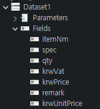

# 자바 Report 프로그램 인수인계
## 작성: 이찬영
---
## 개발 환경 
 - 자바
 - Jasper Studio (레포트 라이브러리)
 - Spring Boot (REST API 처리)
 - 테스트용 프리메이커 (필수X)
 - STS, Jasper stduio plugin 
---
## Jasper Studio 설치

- 설치된 STS에 Jasper stduio plugin 설치

- help -> Eclipse Marketplace

---
## Jasper Studio 설치

- jasper를 검색
- jasper studio 6.16.0을 설치 합니다.
---
## pom.xml 설정
```

        <dependency>
            <groupId>net.sf.jasperreports</groupId>
            <artifactId>jasperreports</artifactId>
            <version>6.11.0</version>
        </dependency>

``` 
 - 자바에서 리포트 함수를 사용하기 위한  JasperReport 라이브러리  
---
## pom.xml 설정
```

        <dependency>
            <groupId>net.sf.jasperreports</groupId>
            <artifactId>jasperreports-fonts</artifactId>
            <version>6.0.0</version>
        </dependency>

```
- 리포트 에서 사용하는 폰트를 프로젝트에서도 사용 가능하도록 추가 
---
## pom.xml 설정
```
        <dependency>
            <groupId>net.sf.barcode4j</groupId>
            <artifactId>barcode4j</artifactId>
            <version>2.1</version>
        </dependency>
                
        <dependency>
            <groupId>org.apache.xmlgraphics</groupId>
            <artifactId>batik-bridge</artifactId>
            <version>1.11</version>
        </dependency>
```
- 리포트에서 바코드 생성하는 라이브러리, 그래픽 라이브러리
---
## pom.xml 설정
```

        <dependency>
            <groupId>org.projectlombok</groupId>
            <artifactId>lombok</artifactId>
            <scope>provided</scope>
        </dependency>

```
- lomok 라리브러리
- 모델 구현을 간편하게 해준다. 
- getter,setter, 생성자 구현  어노테이션을 제공한다.
---
## pom.xml 설정
```

        <dependency>
            <groupId>org.mybatis.spring.boot</groupId>
            <artifactId>mybatis-spring-boot-starter</artifactId>
            <version>1.3.2</version>
        </dependency>

```
- 마이바티스 라이브러리
- mapper 를 사용한 쿼리 저장 기능,동적 쿼리 기능 제공 
- DAO의 impl은 자동 생성 된다.
---
## pom.xml 설정
```

        <dependency>
            <groupId>org.mariadb.jdbc</groupId>
            <artifactId>mariadb-java-client</artifactId>
        </dependency>

```
- 마리아 디비 JDBC 
- 마리아 디비 연결 기능 제공
---
## pom.xml 설정
```

        <dependency>
            <groupId>org.springframework.boot</groupId>
            <artifactId>spring-boot-starter-freemarker</artifactId>
        </dependency>

```
 - freemarker 라이브러리
 - 자바 테플릿 엔진, 동적으로 웹페이지를 생성
 ---
 ## application.properties
 
  - 마이바티스 설정
  - port 설정
  - app 설정 
  - 디비 연결정보
  - freeMaker 연동정보 
---
## jasperreports_extension.properties


   - font 지정을 위한 설정 파일
   - fonts.xml 파일을 불러온다.
---
## fons.xml
```
        <fontFamilies>
            <fontFamily name="malgun">
                <normal>fonts/malgun.ttf</normal>
                <bold>fonts/malgunbd.ttf</bold>
                <Semilight>fonts/malgunsl.ttf</Semilight>
                <pdfEncoding>Identity-H</pdfEncoding>
                <pdfEmbedded>true</pdfEmbedded>
            </fontFamily>
        </fontFamilies>
```
- 폰트를 자바 프로젝트에 추가(맑은 고딕 폰트 사용)
- jsper studio 에도 같은 폰드 추가 필수 입니다. 
- 폰트문제로 한글이 출력되지 않을수있다.
---
## jasper studio 폰트 

- window->Preferences->JasperSoft Studio->font
- ADD 에서 ttf 파일을 지정 해준다.
- ttf 파일은 C드라이브 or 인터넷에서 구하면된다.
---
## jasper studio 폰트

- TrueType : 폰트 디렉토리주소 
- PDF Encoding: Identity-H
- Embed this font in PDF document 체크
---
## Java Resource

 - controller : 요청을 받고 리포트를 셍성을 맡는다.
 - dao: impl은 자동으로 생성된다. 
 - Jasperreports.java : main 클래스
 - JasperReportService.java: jasper 함수 서비스 클래스
 - templates: 웹페이지 템플렛 
 ---
 ## CmmReportController
  - 리포트마다 공통맴버를 상속받는다
 ```
public class PdWorkOrderReportController  extends CmmReportController<PdWorkOrder> 
 ```
1. log(Logger,로그 작성) , model(ModelAndView) 
3. reportService(JasperReportService)
3. source(List<T>, 리포트에서 반복할 데이터)
4. parameters(Map<String, Object>,리포트 파라미터 맵)
5. reportPath(jrxml 파일 경로)
---
## PdWorkOrderReportController
```
@Controller # 컨트롤러 어노테이션
@RequestMapping(value = "/api/PdWorkOrderReport") 
public class PdWorkOrderReportController  extends CmmReportController<PdWorkOrder>
```
 - 리포트 컨트롤러 선언 
 - RequestMapping으로 해당경로로 요청이 들어오면 해당 클래스 bean이 생성 된다.
 ---
 ## PdWorkOrderReportController
 ```
    @GetMapping(value= "/")
	public ModelAndView index() {
		log.info("Showing the welcome page.");
		model.setViewName("welcome");
		return model;
	}
 ```
 - /api/PdWorkOrderReport/ 로 맵핑되면 실행되어 welcome.ftl 템플릿을 출력해준다.
 - 출력전에 출력하시겠습니까? 필요할경우 사용할수있다.
 ---
  ## PdWorkOrderReportController
 ```
	@GetMapping(value = "/view", produces = MediaType.APPLICATION_PDF_VALUE)
	public @ResponseBody byte[] viewReport(
        @RequestParam(value = "CompSeq")int _compSeq,
        @RequestParam(value = "ProdPlanNo")String _prodPlanNo ) 
	{
 ```
 - /api/PdWorkOrderReport/view 로 맵핑되면 실행되어 PDF를 생성
 - GET 방식으로 CompSeq,PdProdPlan의 정보를 받아온다.
 - (ex http://localhost:10091/api/PdWorkOrderReport/view?CompSeq=1&PdProdPlan=PP2103030001)
 ---
## REST API 란?
 

 - REST하게 클라이언트랑 서버간에 데이터를 주고 받는 방식
 - 우리는 GET 방식으로 PDF를 요청 하고 있다.

 ---
 - produces = MediaType.APPLICATION_PDF_VALUE 
 : 응답할 컨텐츠 타입을 지정, PDF 타입으로 지정 하였다.
 - @ResponseBody : View 를 통해서 출력되지 않고 HTTP Response Body로 출력된다.
 - 서버에 저장하는 과정없이 PDF 파일이 요청한 클라이언트로 바로 전달된다.
 - createReport(); 함수의 byte[] 리턴값을 리턴으로 전달하여야한다.
 
 ---
 ## PdWorkOrderReportController
 ```
    # 데이터 구현
    initReportData(CompSeq,PdProdPlan);
	
    # 리포트 생성및 리턴
	return createReport();
 ```
 - createReport() 실행하기전 initReportData 에서 source,parameters,reportPath 초기화 해준다. 
 - createReport() 는 리포트를 생성하도 로그를 찍어준다,
 - 생성된 pdf는 서버에 저장없이 클라이언트로 전달된다.
---
### initReportData
```
this.setReportPath("/reports/PdWorkOrderReport.jrxml");

this.putParameters(ppp);

this.putParameters("SEDay",value);

this.setSource(orderService.selectList(pwo));
```
- setReportPath: 리포트 파일 걍로 입력
- putParameters: 객체 or key,value 로 파라미터에 등록 
-  setSource: 배열 데이터 입력

---
## JASPER STUDIO

 - window->Perspective-> Open Perspective-> Other
 -> Report Design 을 선택
 
 -  
  Report Desig 으로 이동
 ---
 ## JASPER STUDIO
  - reports 폴더에서 New->Other->Jasper Report를 선택
   
  ---
  ## JASPER STUDIO


---
## JASPER STUDIO

---
- 리포트 메이화면 Drag&Drop으로 Elements 추가
- TItle : 전체 리포트의 타이틀, 반복X 
- page Header/Footer: 페이지 마다 반복되는 헤더/푸터 
- Column Header/Footer: 컬럼 마다 반복되는 헤더/푸터
---
## JASPER STUDIO

- Detail: 상세내용, 데이터에따라 반복
- LastPageFooter: 마지막 페이지용 푸터
- Summary : 리포트 요약정보
- Background: 배경
---
## JASPER STUDIO

 - Text Field : 리포트마다 변경될 텍스트를 지정, 함수또는 변수, 파라미터등을 지정
 - Static Text: 변경되지 않는 텍스트
 - Frame: 리포트 모양, 틀을 잡는데 활용 
 - Barcode: 바코드 출력기능 
 ---
 - Table: 테이블이라기보다는 서브 리포트,활용 어려움
 - CrossTab: 다른스타일의 Table
 - Subreport: 리포트 속 리포트
 - 추가로  Chart, 도형 기능이 존재 합니다
---
## JASPER STUDIO

- Styles: 디자인의 프리셋
- Parameters: 외부로 부터 받아올값을 미리 정해서 등록
- Fields: Source 데이터를 지정한다(반복될 핵심 데이터)
- Variables: 함수
- 추가로는 리포트 elements 관리 기능
---
 ## JASPER STUDIO

- elements를 상세하게 수정이 가능 합니다.
- 디자인, 위치, 데이터등을 수정/등록  가능하다.
---
 ## JASPER STUDIO
  
- Text Field 등의 고정 정보가 아닌 항목들을 표현 방법을 등록/수정
- 하단의 제공된 멤버,함수를 사용할수있으며, 자바 기본 함수를 사용할수도 있다.
---
## JASPER STUDIO
 ### SUB Rrport
  - 리포트안에 리포트를 만들수 있습니다. jrxml 파일을 임포트할수있다.
  
  - just create the subreport element 를 선택한다.
  - 다음과정없이 Finish 를선택
  ---
  ### SUB Rrport 
  
   - 서브 리포트의 Properties ->Subreport : 서브리포트 정보,파라미터, 데이터 소스 등 정의 해야 한다.
  ---
 ### SUB Rrport
 - Expression: 서브리포트 표현식, 메인 리포트의 파라미터에 서브리포트정보를 등록해야한다.
 
 - class는 net.sf.jasperreports.engine.JasperReport로 지정
 ---
 ### SUB Rrport
 - 서브 리포트 Expression 메인리포트의 파라미터로 전송 
 ```
    InputStream stream = this.getClass().getResourceAsStream("서브 리포트 파일 경로");
    JasperReport subReport = JasperCompileManager.compileReport(stream);
    this.putParameters("파라미터", subReport);
 ```
 - getResourceAsStream(): 리포트 파일 읽는다.
 - JasperCompileManager.compileReport(): 리포트 파일 컴파일
 -  this.putParameters(): 파라미터 등록

---
 ### SUB Rrport
 Parameters Map Expression: 서브리포트 파라미터 맵 표현식, 메인 리포트의 파라미터에 서브리포트 파라미터 정보를 등록해야한다.
 
 - class는 java.util.Map 으로 지정 
---
- 서브 리포트  Parameters Map Expression 메인리포트의 파라미터로 전송 
```
Map<String , Object> parameterSubReport = new HashMap<String , Object>();
parameterUpReport.put("key","value");
this.putParameters("parameterSubReport",parameterSubReport);
```
 - Map<String ,Object> 변수를 생성한후 서브리포트에 맵정보를 등록 
 - 메인 파라미터 맵에 등록하면 된다.
---
 ### SUB Rrport
 Data source Expression: 서브리포트 데이터 맵 표현식, 메인 리포트의 파라미터에 서브리포트 데이터 정보를 등록해야한다.
 
 - class는 net.sf.jasperreports.engine.JRDataSource 입니다.
 - 빈데이터 소스를 입력시 JREmptyDataSource 로 대체 가능하다.
---
- 서브 리포트  Data source Expression 메인리포트의 파라미터로 전송 
```
JRDataSource subData = new JRBeanCollectionDataSource(_list);
this.putParameters("subData",subData)
```
_list 정보를 JRDataSource로 바꿔생성해준후 메인 리포트 파라미터에 등록한다.

---
 ### TABLE
  -  테이블 모양 서브 리포트와 유사
  -  따라서 데이터 셋을 지정해야한다.

  
  - create a table using a new dataset을 선택한다.
  - 다음과정없이 Finish 를선택
---
### TABLE

- 테이블의 데이터 셋을 리포트에 파라미터로 받아와야한다.
- USE a JRDatasource expression을 선택

---
### TABLE

 - 리포트 파라미터 class: net.sf.jasperreports.engine.data.JRBeanCollectionDataSource
---
### TABLE

 - 테이블 데이터셋에 Fields 값을 지정한다.
 - 테이블 에 필요한 요소를 넣고 Fields 값을 지정 한다.

 

---
### TABLE
```
JRDataSource tableData = new JRBeanCollectionDataSource(list);
this.putParameters("tableData",tableData);
```
- 리스트를 데이터 소스로 만든다음 리포트 파라미터에 등록한다.
---
 ### 서브 리포트, 테이블 활용 
 - 서브리포트 안에 테이블 을 만들거나 서브리포트에 서브 리포트 를 만들경우
 - 메인 리포트 파라미터 맵에 서브 리포트 파라미터를 등록하고 
 - 테이블 또는 서브의서브의 정보를 서브 리포트 파라미터에 등록한다.
 ---
 ### 바코드 등록
 
- code 128 로 생성하고 테이터 및 모양을 설정한다.
---
### 이미지 등록


 - java.io.InputStream로 이미지를 파라미터 맵에 등록한다.
 ---
 ```
 InputStream img = this.getClass().getResourceAsStream("#이미지 경로#");
 this.putParameters("img",img);
 ``` 
  - 이미지를 getResourceAsStream() 으로 InputStream 형태로 만든다.
  - 파라미터에 등록하여 리포트로 전송한다.
 