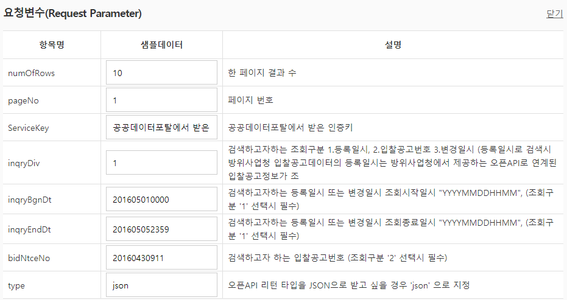
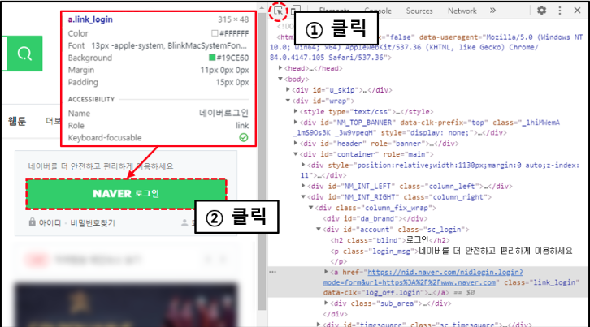
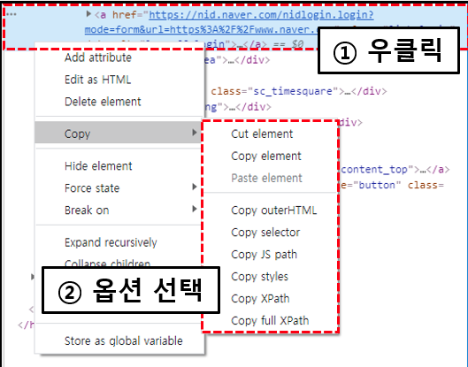

# 호암정공 개발 내용
## 작성 이찬영

---

# Open API (Rest API)

- REST API ?
    - HTTP 기반으로 필요자원에 접근한는 방식의 API
    - URL 과 파라미터로 입력하면 xml 이나 Json 으로 데이터를 가져온다
    - URL?parameter1=value1&parameter2=value2......

---

# 공공데이터 포털

- [www.data.go.kr](https://www.data.go.kr/)
- 조달청 입찰공고 오픈API: [https://www.data.go.kr/data/15000802/openapi.do](https://www.data.go.kr/data/15000802/openapi.do)
- 가입후 조달청 입찰공고 오픈 API의 활용 신청을 하여 승인받으면 사용이 가능 하다.

---

# Open API (Rest API)

- 결과

[http://apis.data.go.kr/1230000/BidPublicInfoService/getBidPblancListInfoCnstwk?serviceKey=sKmE7SbM9GXODsoANFDqys4sMZhDKcA5DOisX9ll7ASVYjbkrA4wSTgdCLnF1ICs3E7Ypmc2fwhLERQir3Dpkw%3D%3D&numOfRows=10&pageNo=1&inqryDiv=1&inqryBgnDt=201605010000&inqryEndDt=201605052359&bidNtceNo=20160430911&type=json](http://apis.data.go.kr/1230000/BidPublicInfoService/getBidPblancListInfoCnstwk?serviceKey=sKmE7SbM9GXODsoANFDqys4sMZhDKcA5DOisX9ll7ASVYjbkrA4wSTgdCLnF1ICs3E7Ypmc2fwhLERQir3Dpkw%3D%3D&numOfRows=10&pageNo=1&inqryDiv=1&inqryBgnDt=201605010000&inqryEndDt=201605052359&bidNtceNo=20160430911&type=json)

---



---

# Open API (Rest API)

```jsx
WebClient webClient = new WebClient();
string restApiUrl = "URL?"

string responseJSON = new StreamReader(stream).ReadToEnd();            
JavaScriptSerializer jser = new JavaScriptSerializer();
JsonClass<SaBidRcv> jCls = jser.Deserialize<JsonClass<SaBidRcv>>(responseJSON);

return jCls;
```

---

```jsx
public class JsonClass<T>
{
	 public Response<T> response { get; set; }
 }
```


```jsx
public class Response<T>
{
         
    public Header header { get; set; }
    public Body<T> body { get; set; }
}
```

---

```jsx
public class Header
{

    public string resultCode { get; set; }
    public string resultMsg { get; set; }
}
```


```jsx
public class Body<T>
{
  
public List<T> items { get; set; }
public int numOfRows { get; set; }
public int pageNo { get; set; }
public int totalCount { get; set; }
}
```

---

# 웹크롤링

- 셀레니움 ?
    - 웹크라우저 자동화 라이브러리
    - 크롤링 뿐만 아니라 브라우저를 컨트롤할수있다.
- [https://luckygg.tistory.com/248](https://luckygg.tistory.com/248)

---

# Xpath 복사하기



---



---

# Xpath 복사하기

```csharp
var element = _driver.FindElementByXPath("//*[@id='account']/a");
element.Click(); //버튼 클릭.
```

---

# 자동 로그인 기능 구현

```csharp
_driver.Navigate().GoToUrl("https://www.kpi.or.kr"); // 웹 사이트에 접속합니다.
var element = _driver.FindElementByXPath("//*[@id='mem_info_out']/input[1]"); // id 입력창
element.SendKeys(id);//id 입력
element = _driver.FindElementByXPath("//*[@id='mem_info_out']/input[2]");//비번 입력창 
element.SendKeys(pw);//비번 입력 
element = _driver.FindElementByXPath("//*[@id='mem_info_out']/input[3]");//로그인 버튼
element.Click();// 로그인 버튼 클릭 
```

---

# 테이블 읽어오기

```csharp
// 웹 사이트에 접속합니다.
_driver.Navigate().GoToUrl("URL?CATE_CD="+ CateCd); 

var table = _driver.FindElementByXPath("//*[@id='table_all']");
var tbody = table.FindElement(By.TagName("tbody"));
var trs = tbody.FindElements(By.TagName("tr"));
```

---

```csharp
foreach (var tr in trs)
{
	var tds = tr.FindElements(By.TagName("td"));
	foreach (var td in tds)
	{
		switch(td.Text)
		{
			case "품명":
			colNmRow["ItemNm"] = td.Text;
			...
		}
	}
}
```